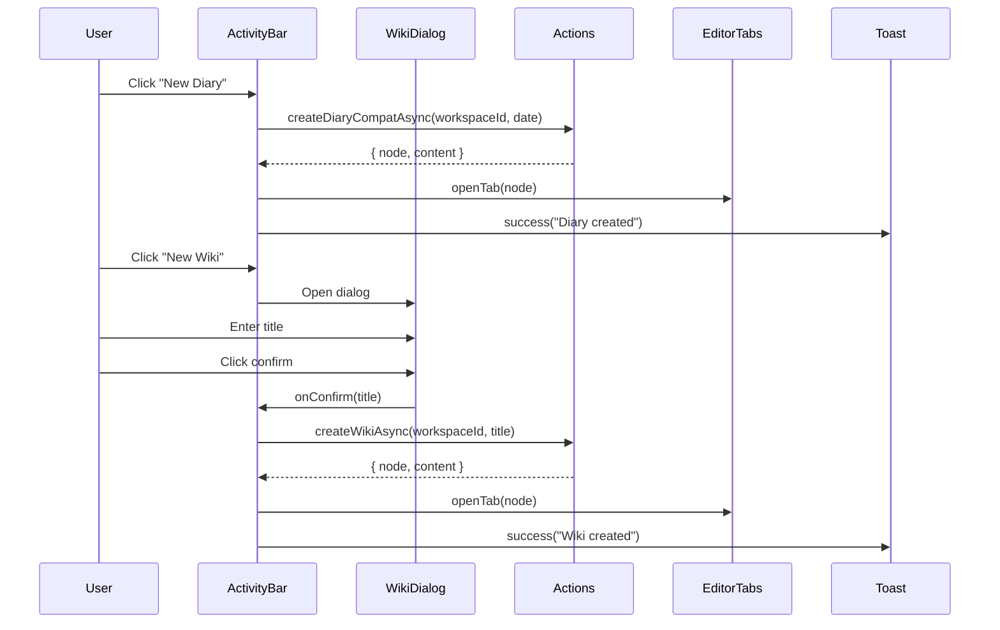
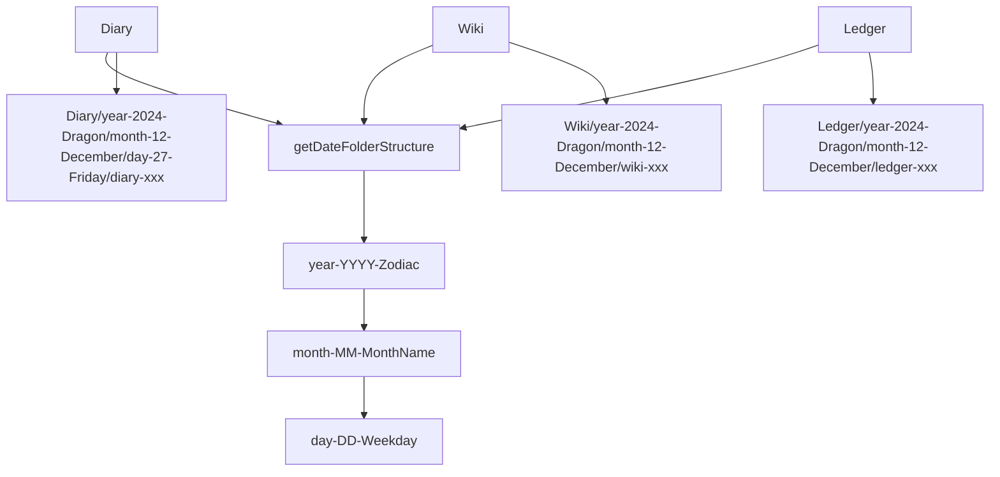

# Design Document

## Overview

本设计文档描述如何将已完成的 Diary 和 Wiki 创建功能集成到 ActivityBar 组件中，并修复 Ledger 文件夹结构的问题。

### 目标

1. 将 `createDiaryCompatAsync` 集成到 `handleCreateDiary` 回调
2. 将 `createWikiAsync` 集成到 `handleCreateWiki` 回调，并添加标题输入对话框
3. 修复 Ledger 文件夹结构，使用统一的带生肖年份格式
4. 确保 E2E 测试通过

### 设计原则

- 复用现有的高阶函数 `createTemplatedFile`
- 保持与 Ledger 创建功能的一致性
- 使用统一的日期文件夹结构函数 `getDateFolderStructure`

## Architecture

### 组件交互图



### 文件夹结构统一



## Components and Interfaces

### 1. ActivityBar Container 修改

修改 `activity-bar.container.fn.tsx` 中的回调函数：

```typescript
// 现有的 handleCreateLedger 模式（参考）
const handleCreateLedger = useCallback(async () => {
  if (!selectedWorkspaceId) {
    toast.error("Please select a workspace first");
    return;
  }
  try {
    const result = await createLedgerCompatAsync({
      workspaceId: selectedWorkspaceId,
      date: new Date(),
    });
    openTab({
      workspaceId: selectedWorkspaceId,
      nodeId: result.node.id,
      title: result.node.title,
      type: result.node.type,
    });
    toast.success("Ledger created");
  } catch (error) {
    console.error("Failed to create ledger:", error);
    toast.error("Failed to create ledger");
  }
}, [selectedWorkspaceId, openTab]);

// 新的 handleCreateDiary（遵循相同模式）
const handleCreateDiary = useCallback(async () => {
  if (!selectedWorkspaceId) {
    toast.error("Please select a workspace first");
    return;
  }
  try {
    const result = await createDiaryCompatAsync({
      workspaceId: selectedWorkspaceId,
      date: new Date(),
    });
    openTab({
      workspaceId: selectedWorkspaceId,
      nodeId: result.node.id,
      title: result.node.title,
      type: result.node.type,
    });
    toast.success("Diary created");
  } catch (error) {
    console.error("Failed to create diary:", error);
    toast.error("Failed to create diary");
  }
}, [selectedWorkspaceId, openTab]);

// 新的 handleCreateWiki（需要对话框）
const [wikiDialogOpen, setWikiDialogOpen] = useState(false);

const handleCreateWiki = useCallback(async () => {
  if (!selectedWorkspaceId) {
    toast.error("Please select a workspace first");
    return;
  }
  setWikiDialogOpen(true);
}, [selectedWorkspaceId]);

const handleWikiDialogConfirm = useCallback(async (title: string) => {
  if (!selectedWorkspaceId) return;
  try {
    const result = await createWikiAsync({
      workspaceId: selectedWorkspaceId,
      templateParams: { title },
    });
    openTab({
      workspaceId: selectedWorkspaceId,
      nodeId: result.node.id,
      title: result.node.title,
      type: result.node.type,
    });
    toast.success("Wiki created");
    setWikiDialogOpen(false);
  } catch (error) {
    console.error("Failed to create wiki:", error);
    toast.error("Failed to create wiki");
  }
}, [selectedWorkspaceId, openTab]);
```

### 2. Wiki 标题输入对话框

创建新组件 `wiki-title-dialog.tsx`：

```typescript
interface WikiTitleDialogProps {
  readonly open: boolean;
  readonly onOpenChange: (open: boolean) => void;
  readonly onConfirm: (title: string) => void;
}

export function WikiTitleDialog({
  open,
  onOpenChange,
  onConfirm,
}: WikiTitleDialogProps) {
  const [title, setTitle] = useState("");
  const [error, setError] = useState("");

  const handleConfirm = () => {
    if (!title.trim()) {
      setError("Please enter a wiki title");
      return;
    }
    onConfirm(title.trim());
    setTitle("");
    setError("");
  };

  const handleKeyDown = (e: React.KeyboardEvent) => {
    if (e.key === "Enter") {
      handleConfirm();
    }
  };

  return (
    <Dialog open={open} onOpenChange={onOpenChange}>
      <DialogContent>
        <DialogHeader>
          <DialogTitle>Create Wiki</DialogTitle>
        </DialogHeader>
        <div className="space-y-4">
          <Input
            placeholder="Enter wiki title"
            value={title}
            onChange={(e) => {
              setTitle(e.target.value);
              setError("");
            }}
            onKeyDown={handleKeyDown}
          />
          {error && <p className="text-sm text-destructive">{error}</p>}
        </div>
        <DialogFooter>
          <Button variant="outline" onClick={() => onOpenChange(false)}>
            Cancel
          </Button>
          <Button onClick={handleConfirm}>Create</Button>
        </DialogFooter>
      </DialogContent>
    </Dialog>
  );
}
```

### 3. Ledger 配置修改

修改 `ledger.config.ts` 使用统一的日期函数：

```typescript
// 修改前
import { getLedgerFolderStructure } from "@/fn/ledger";

const generateLedgerFolderPath = (params: LedgerTemplateParams): string[] => {
  const date = params.date || dayjs().toDate();
  const structure = getLedgerFolderStructure(date);
  return [structure.yearFolder, structure.monthFolder];
};

// 修改后
import { getDateFolderStructure } from "@/fn/date";

const generateLedgerFolderPath = (params: LedgerTemplateParams): string[] => {
  const date = params.date || dayjs().toDate();
  const structure = getDateFolderStructure(date);
  return [structure.yearFolder, structure.monthFolder];
};
```

## Data Models

### Wiki 创建参数

```typescript
interface WikiTemplateParams {
  /** Wiki 标题 */
  readonly title: string;
  /** 创建日期（可选，默认为当前时间） */
  readonly date?: Date;
}
```

### 编辑器标签页参数

```typescript
interface OpenTabParams {
  readonly workspaceId: string;
  readonly nodeId: string;
  readonly title: string;
  readonly type: NodeType;
}
```

## Correctness Properties

*A property is a characteristic or behavior that should hold true across all valid executions of a system-essentially, a formal statement about what the system should do. Properties serve as the bridge between human-readable specifications and machine-verifiable correctness guarantees.*

### Property 1: Diary creation triggers correct function call

*For any* workspace ID and date, when `handleCreateDiary` is called, `createDiaryCompatAsync` should be called with the correct workspace ID and current date.

**Validates: Requirements 1.1**

### Property 2: Wiki creation triggers correct function call with user input

*For any* workspace ID and non-empty title string, when `handleWikiDialogConfirm` is called, `createWikiAsync` should be called with the correct workspace ID and title.

**Validates: Requirements 2.2**

### Property 3: Successful creation opens file in EditorTabs

*For any* successful templated file creation (Diary, Wiki, or Ledger), the `openTab` function should be called with the correct node information (workspaceId, nodeId, title, type).

**Validates: Requirements 1.2, 2.3**

### Property 4: Wiki dialog input updates in real-time

*For any* string typed into the wiki title input field, the input value should immediately reflect the typed string.

**Validates: Requirements 3.2**

### Property 5: Wiki dialog confirm triggers creation with non-empty title

*For any* non-empty title string, clicking the confirm button should close the dialog and trigger wiki creation with that title.

**Validates: Requirements 3.4**

### Property 6: Ledger folder structure matches Diary format

*For any* date, the Ledger folder structure should use the same year folder format as Diary (year-YYYY-{Zodiac}), ensuring consistency across all templated files.

**Validates: Requirements 5.1, 5.2, 5.4**

### Property 7: Ledger content includes required sections and tags

*For any* Ledger creation, the generated Lexical JSON content should include:
- Income section
- Expenses section
- Summary section
- Notes section
- Tags: `#[ledger]` and `#[YYYY-MM-DD]`

**Validates: Requirements 6.1, 6.3**

## Error Handling

### 错误场景

| 场景 | 处理方式 |
|------|----------|
| 未选择工作区 | 显示 toast.error("Please select a workspace first") |
| 创建失败 | 显示 toast.error("Failed to create {type}") |
| Wiki 标题为空 | 显示验证错误 "Please enter a wiki title" |

### 错误处理模式

```typescript
try {
  const result = await createXxxAsync(params);
  // 成功处理
  openTab({ ... });
  toast.success("Xxx created");
} catch (error) {
  console.error("Failed to create xxx:", error);
  toast.error("Failed to create xxx");
}
```

## Testing Strategy

### 单元测试

| 测试文件 | 测试内容 |
|----------|----------|
| `activity-bar.container.fn.test.tsx` | 测试 handleCreateDiary 和 handleCreateWiki 回调 |
| `wiki-title-dialog.test.tsx` | 测试对话框交互和验证 |
| `ledger.config.test.ts` | 测试 Ledger 文件夹结构生成 |

### 属性测试

使用 fast-check 进行属性测试：

```typescript
// Property 6: Ledger folder structure matches Diary format
it("should generate Ledger folder with zodiac year format", () => {
  fc.assert(
    fc.property(fc.date(), (date) => {
      const diaryStructure = getDateFolderStructure(date);
      const ledgerPath = generateLedgerFolderPath({ date });
      
      // 年份文件夹应该相同
      expect(ledgerPath[0]).toBe(diaryStructure.yearFolder);
      // 年份文件夹应该包含生肖
      expect(ledgerPath[0]).toMatch(/^year-\d{4}-\w+$/);
    })
  );
});
```

### E2E 测试

E2E 测试已存在于 `apps/desktop/e2e/tests/` 目录，集成后应通过以下测试：

- `diary.e2e.ts`: Diary Folder Structure Created, Diary File Appears in File Tree
- `wiki.e2e.ts`: Wiki Folder Structure Created, Wiki File Appears in File Tree
- `ledger.e2e.ts`: Ledger Folder Structure Created (with zodiac year)
