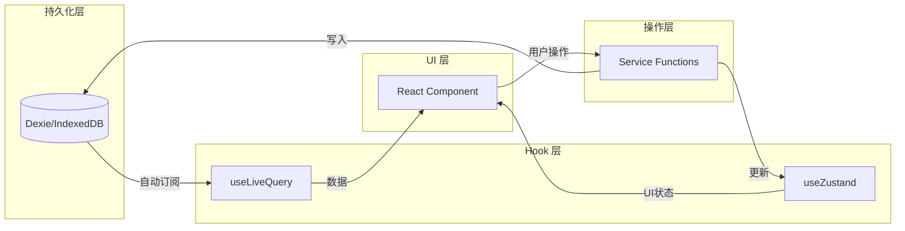

# Design Document: Data-Driven Architecture

## Overview

本设计文档定义了 Novel Editor 的数据驱动架构，建立清晰的数据层次结构和职责边界。核心原则是：**数据是唯一真相来源，组件只负责渲染数据，所有业务操作都针对数据而非组件**。

### 设计目标

1. **单一数据源**: Dexie (IndexedDB) 作为所有持久化数据的唯一来源
2. **响应式更新**: 使用 `useLiveQuery` 实现数据变化自动触发 UI 更新
3. **职责分离**: Zustand 仅管理 UI 临时状态，不存储业务数据
4. **类型安全**: Schema → Interface → Zod → Builder 的完整类型链
5. **高性能**: 针对 5000+ 字符文档优化的存储和加载策略

## Architecture

### 数据层次架构

```
┌─────────────────────────────────────────────────────────────┐
│                    Component Layer                          │
│  (React Components - 只负责渲染，不持有业务状态)              │
└─────────────────────────────────────────────────────────────┘
                              │
                              ▼
┌─────────────────────────────────────────────────────────────┐
│                     Hook Layer                              │
│  useLiveQuery (持久化数据)  │  useZustandStore (UI状态)      │
└─────────────────────────────────────────────────────────────┘
                              │
                              ▼
┌─────────────────────────────────────────────────────────────┐
│                    Service Layer                            │
│  (业务逻辑、数据转换、验证)                                   │
└─────────────────────────────────────────────────────────────┘
                              │
              ┌───────────────┴───────────────┐
              ▼                               ▼
┌─────────────────────────┐     ┌─────────────────────────┐
│    Dexie (IndexedDB)    │     │   Zustand (Memory)      │
│    持久化业务数据         │     │   UI 临时状态            │
│  - Projects             │     │  - activePanel          │
│  - Nodes                │     │  - sidebarOpen          │
│  - WikiEntries          │     │  - selectedNodeId       │
│  - Drawings             │     │  - expandedFolders      │
└─────────────────────────┘     └─────────────────────────┘
```

### 数据流向



## Components and Interfaces

### 1. Schema Layer (`db/schema.ts`)

定义所有数据实体的 TypeScript 接口：

```typescript
// 现有接口保持不变
export interface NodeInterface { ... }
export interface ProjectInterface { ... }
export interface WikiEntryInterface { ... }
```

### 2. Validation Layer (`db/validators.ts`) - 新增

使用 Zod 进行运行时验证：

```typescript
import { z } from "zod";

// Node 验证 Schema
export const NodeSchema = z.object({
  id: z.string().uuid(),
  workspace: z.string().uuid(),
  parent: z.string().uuid().nullable(),
  type: z.enum(["folder", "file", "canvas", "diary"]),
  title: z.string().min(1).max(200),
  order: z.number().int().min(0),
  content: z.string().optional(),
  collapsed: z.boolean().optional(),
  createDate: z.string().datetime(),
  lastEdit: z.string().datetime(),
});

// 创建时的部分 Schema（不需要 id 和时间戳）
export const NodeCreateSchema = NodeSchema.omit({
  id: true,
  createDate: true,
  lastEdit: true,
});

// 更新时的部分 Schema
export const NodeUpdateSchema = NodeSchema.partial().omit({ id: true });
```

### 3. Builder Layer (`db/builders.ts`) - 新增

使用 Builder 模式创建对象：

```typescript
import { v4 as uuidv4 } from "uuid";
import dayjs from "dayjs";
import type { NodeInterface, NodeType } from "./schema";
import { NodeSchema } from "./validators";

export class NodeBuilder {
  private node: Partial<NodeInterface> = {};

  constructor() {
    // 设置默认值
    this.node = {
      id: uuidv4(),
      type: "file",
      title: "New Node",
      order: 0,
      collapsed: true,
      createDate: dayjs().toISOString(),
      lastEdit: dayjs().toISOString(),
    };
  }

  workspace(id: string): this {
    this.node.workspace = id;
    return this;
  }

  parent(id: string | null): this {
    this.node.parent = id;
    return this;
  }

  type(type: NodeType): this {
    this.node.type = type;
    return this;
  }

  title(title: string): this {
    this.node.title = title;
    return this;
  }

  order(order: number): this {
    this.node.order = order;
    return this;
  }

  content(content: string): this {
    this.node.content = content;
    return this;
  }

  collapsed(collapsed: boolean): this {
    this.node.collapsed = collapsed;
    return this;
  }

  build(): NodeInterface {
    // 验证并返回
    const result = NodeSchema.parse(this.node);
    return result as NodeInterface;
  }

  // 用于更新操作，返回部分对象
  buildPartial(): Partial<NodeInterface> {
    this.node.lastEdit = dayjs().toISOString();
    return { ...this.node };
  }
}

// 使用示例
const node = new NodeBuilder()
  .workspace("project-123")
  .parent(null)
  .type("folder")
  .title("Chapter 1")
  .build();
```

### 4. 数据调度策略

| 数据类型 | 存储位置 | 访问方式 | 说明 |
|---------|---------|---------|------|
| Projects | Dexie | `useLiveQuery` | 项目列表，持久化 |
| Nodes | Dexie | `useLiveQuery` | 文件树节点，持久化 |
| WikiEntries | Dexie | `useLiveQuery` | Wiki 条目，持久化 |
| Drawings | Dexie | `useLiveQuery` | 绘图数据，持久化 |
| Node Content | Dexie | `useLiveQuery` | Lexical JSON，持久化 |
| Active Panel | Zustand | `useStore` | 当前激活面板，临时 |
| Sidebar State | Zustand | `useStore` | 侧边栏开关，临时 |
| Selection | Zustand | `useStore` | 当前选中项，临时 |
| Expanded Folders | Zustand | `useStore` | 展开状态，临时 |
| Editor Tabs | Zustand + Dexie | 混合 | 标签页列表持久化，编辑器状态临时 |

### 5. 为什么不需要 TanStack Query

| 特性 | TanStack Query | dexie-react-hooks |
|-----|---------------|-------------------|
| 主要用途 | 服务端数据缓存 | 本地数据库订阅 |
| 数据来源 | HTTP API | IndexedDB |
| 缓存策略 | stale-while-revalidate | 实时订阅 |
| 自动更新 | 需要配置 | 数据变化自动触发 |
| 离线支持 | 需要额外配置 | 原生支持 |

**结论**: 对于纯本地应用，`useLiveQuery` 已经提供了响应式数据订阅，不需要 TanStack Query。

## Data Models

### 现有数据模型保持不变

参考 `db/schema.ts` 中的接口定义。

### 新增：UI State 模型

```typescript
// stores/ui-state.ts
interface UIState {
  // 侧边栏状态
  sidebar: {
    isOpen: boolean;
    activePanel: "files" | "search" | "wiki" | "drawings" | null;
    width: number;
  };
  
  // 选择状态
  selection: {
    projectId: string | null;
    nodeId: string | null;
  };
  
  // 文件树状态
  fileTree: {
    expandedFolders: Record<string, boolean>;
  };
}
```

## Correctness Properties

*A property is a characteristic or behavior that should hold true across all valid executions of a system-essentially, a formal statement about what the system should do. Properties serve as the bridge between human-readable specifications and machine-verifiable correctness guarantees.*

基于需求分析，以下是需要验证的正确性属性：

### Property 1: Data Round-Trip Consistency

*For any* valid data entity (Node, Project, WikiEntry), writing to Dexie and then reading back should produce an equivalent object (excluding auto-generated timestamps).

**Validates: Requirements 1.3, 5.1**

### Property 2: Schema Validation Correctness

*For any* data object, if it passes Zod schema validation, then it should be successfully stored in Dexie; if it fails validation, the operation should be rejected with an error.

**Validates: Requirements 2.2, 2.3, 2.5**

### Property 3: Builder Produces Valid Objects

*For any* sequence of Builder method calls that includes all required fields, the `build()` method should return an object that passes the corresponding Zod schema validation.

**Validates: Requirements 3.1, 3.2, 3.4, 3.5**

### Property 4: Builder Fluent API

*For any* Builder method call (except `build()`), the method should return the Builder instance itself, enabling method chaining.

**Validates: Requirements 3.1, 3.3**

### Property 5: Editor State Preservation

*For any* editor tab, switching away and then switching back should preserve the editor's serialized state (content, scroll position metadata).

**Validates: Requirements 5.4**

### Property 6: Backward Compatibility

*For any* data stored in the old format (pre-migration), the system should be able to read and convert it to the new format without data loss.

**Validates: Requirements 6.3**

## Error Handling

### 验证错误

```typescript
try {
  const node = new NodeBuilder()
    .workspace("invalid") // 不是有效 UUID
    .build();
} catch (error) {
  if (error instanceof z.ZodError) {
    // 处理验证错误
    console.error("Validation failed:", error.errors);
  }
}
```

### 数据库错误

```typescript
try {
  await db.addNode(node);
} catch (error) {
  if (error.name === "ConstraintError") {
    // 处理唯一约束冲突
  } else if (error.name === "QuotaExceededError") {
    // 处理存储空间不足
  }
}
```

## Testing Strategy

### 测试框架

- **单元测试**: Vitest
- **属性测试**: fast-check (Property-Based Testing)

### 双重测试策略

1. **单元测试**: 验证具体示例和边界情况
2. **属性测试**: 验证通用属性在所有输入上成立

### 属性测试示例

```typescript
import { fc } from "fast-check";
import { NodeBuilder } from "./builders";
import { NodeSchema } from "./validators";

// **Feature: data-driven-architecture, Property 3: Builder Produces Valid Objects**
describe("NodeBuilder", () => {
  it("should always produce valid nodes", () => {
    fc.assert(
      fc.property(
        fc.uuid(),           // workspace
        fc.option(fc.uuid()), // parent
        fc.constantFrom("folder", "file", "canvas", "diary"),
        fc.string({ minLength: 1, maxLength: 200 }),
        (workspace, parent, type, title) => {
          const node = new NodeBuilder()
            .workspace(workspace)
            .parent(parent ?? null)
            .type(type)
            .title(title)
            .build();
          
          // 验证结果符合 Schema
          const result = NodeSchema.safeParse(node);
          return result.success;
        }
      ),
      { numRuns: 100 }
    );
  });
});
```

### 单元测试示例

```typescript
// **Feature: data-driven-architecture, Property 4: Builder Fluent API**
describe("Builder Fluent API", () => {
  it("should return builder instance for chaining", () => {
    const builder = new NodeBuilder();
    expect(builder.workspace("123")).toBe(builder);
    expect(builder.title("test")).toBe(builder);
    expect(builder.type("file")).toBe(builder);
  });
});
```

