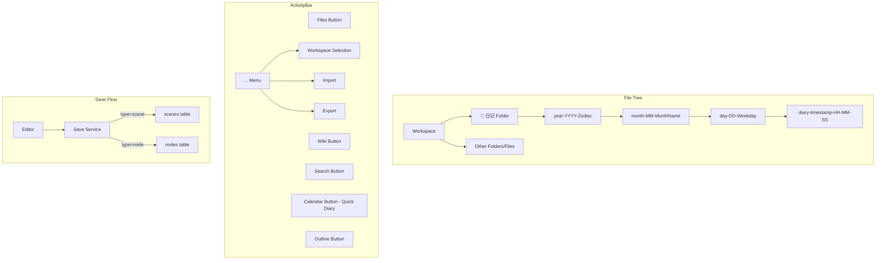

# Design Document

## Overview

本设计文档描述将日记功能整合到文件树、简化 ActivityBar、以及支持 Tab 位置配置的技术方案。

**当前优先级：修复日记保存问题**

核心改动：
1. **日记保存修复**（优先）：确保 node 类型的文件（日记）能正确保存到 nodes 表
2. **日历图标恢复**：在 ActivityBar 添加日历图标用于快速创建日记
3. **日记整合**：日记作为文件树中的特殊文件夹，使用 nodes 结构
4. **UI 简化**：移除独立的 Library 和 Diary 按钮，工作空间选择移到 "..." 菜单
5. **Tab 配置**：支持 Tab 显示在顶部或右侧边栏

**注意**：scene/chapter 结构的移除和 Lexical 编辑器的 org-mode 支持将在后续 spec 中处理。

## Architecture



## Components and Interfaces

### 1. Diary Service (Updated)

```typescript
// apps/desktop/src/services/diary-v2.ts

interface DiaryFolderStructure {
  yearFolder: string;      // "year-2024-Dragon"
  monthFolder: string;     // "month-12-December"
  dayFolder: string;       // "day-14-Saturday"
  filename: string;        // "diary-1734192000-14:30:00"
}

interface DiaryMetadata {
  title: string;
  author: string;
  email: string;
  date: string;
  year: string;           // "甲辰 Dragon"
  createTime: string;     // "2024-12-14 14:30:00 未时"
  device: string;
  tags: string[];
}

// 生成日记文件夹结构
function getDiaryFolderStructure(date: Date): DiaryFolderStructure;

// 生成日记内容（Lexical JSON 格式，但包含 org-mode 风格的元数据）
function generateDiaryContent(metadata: DiaryMetadata): string;

// 在文件树中创建日记
async function createDiaryInFileTree(workspaceId: string): Promise<string>;
```

### 2. Diary Folder Constants

```typescript
// 日记根文件夹名称
const DIARY_ROOT_FOLDER = "📔 日记";

// 文件夹命名格式
const YEAR_FOLDER_FORMAT = "year-{YYYY}-{Zodiac}";
const MONTH_FOLDER_FORMAT = "month-{MM}-{MonthName}";
const DAY_FOLDER_FORMAT = "day-{DD}-{Weekday}";
const DIARY_FILE_FORMAT = "diary-{timestamp}-{HH-MM-SS}"; // Cross-platform compatible (no colons)
```

### 3. Updated FileTree Header

```typescript
// apps/desktop/src/components/file-tree/file-tree.tsx

// 添加 "New Diary" 按钮到 header
<div className="flex items-center gap-1">
  <Button onClick={onCreateDiary} title="New Diary">
    <Calendar className="size-4" />
  </Button>
  <Button onClick={() => onCreateFolder(null)} title="New Folder">
    <FolderPlus className="size-4" />
  </Button>
  <Button onClick={() => onCreateFile(null, "file")} title="New File">
    <Plus className="size-4" />
  </Button>
</div>
```

### 4. Updated ActivityBar

```typescript
// apps/desktop/src/components/activity-bar.tsx

// 移除的按钮：
// - Library (books panel)
// - Diary panel (独立面板)

// 保留的按钮：
// - Files (file tree panel)
// - Wiki
// - Search
// - Calendar (快速创建日记) - 新增/保留
// - Outline (page navigation)
// - Statistics (page navigation)
// - Settings (page navigation)

// Calendar 按钮行为：
// - 点击后调用 createDiaryInFileTree(workspaceId)
// - 自动打开创建的日记文件
// - 如果没有选择工作空间，显示错误提示

// "..." 菜单新增：
// - Workspace Selection (dropdown with all workspaces)
// - New Workspace
// - Import
// - Export
// - Delete All
```

### 5. Node Save Service (新增)

```typescript
// apps/desktop/src/services/node-save.ts

import { db } from "@/db/curd";
import type { SerializedEditorState } from "lexical";

export interface NodeSaveResult {
  success: boolean;
  error?: string;
  timestamp: Date;
}

/**
 * 保存节点内容到 nodes 表
 * 用于日记文件和其他 node 类型的文件
 */
export async function saveNodeContent(
  nodeId: string,
  content: SerializedEditorState
): Promise<NodeSaveResult> {
  const timestamp = new Date();
  try {
    const contentString = JSON.stringify(content);
    await db.updateNode(nodeId, {
      content: contentString,
      lastEdit: timestamp.toISOString(),
    });
    return { success: true, timestamp };
  } catch (error) {
    return {
      success: false,
      error: error instanceof Error ? error.message : "Unknown error",
      timestamp,
    };
  }
}
```

### 6. Updated Save Service

```typescript
// apps/desktop/src/services/save.ts

// 修改 saveDocument 方法，根据文档类型选择保存目标：
// - scene 类型: 保存到 scenes 表 (db.updateScene)
// - node 类型: 保存到 nodes 表 (db.updateNode)

async saveDocument(
  documentId: string,
  content: SerializedEditorState,
  documentType: "scene" | "node" = "scene"
): Promise<SaveResult> {
  // ... 
  if (documentType === "node") {
    await db.updateNode(documentId, {
      content: contentString,
      lastEdit: timestamp.toISOString(),
    });
  } else {
    await db.updateScene(documentId, {
      content: contentString,
      lastEdit: timestamp.toISOString(),
    });
  }
  // ...
}
```

### 5. Tab Position Store

```typescript
// apps/desktop/src/stores/ui-settings.ts

interface UISettingsState {
  tabPosition: "top" | "right-sidebar";
  setTabPosition: (position: "top" | "right-sidebar") => void;
}

const useUISettingsStore = create<UISettingsState>()(
  persist(
    (set) => ({
      tabPosition: "right-sidebar", // default
      setTabPosition: (position) => set({ tabPosition: position }),
    }),
    { name: "novel-editor-ui-settings" }
  )
);
```

## Data Models

### Diary File Content Structure

日记文件使用 Lexical JSON 格式存储，但内容模拟 org-mode 风格（无 Mermaid 甘特图）：

```
#+TITLE: My Document
#+AUTHOR: Martin
#+Email: chenzhang7618@163.com
#+DATE: 2025-12-14
#+YEAR: 乙巳 Snake
#+CREATE_TIME: 2025-12-14 17:36:25 酉时
#+DEVICE: Linux archlinux 6.17.9-zen1-1-zen #1 ZEN SMP PREEMPT_DYNAMIC Mon, 24 Nov 2025 15:21:16 +0000 x86_64 GNU/Linux
#+TAGS: org-mode, notes, document
#+OPTIONS: toc:nil
#+TOC: headlines
#+HTML_HEAD: <link rel="stylesheet" type="text/css" href="...">

** TODO

*** Action
+ XXXXXX
+ XXXXXX

** Content

```

### Node vs Scene Data Storage

| 属性 | Node (日记/文件树) | Scene (旧结构) |
|------|-------------------|----------------|
| 表名 | nodes | scenes |
| 保存方法 | db.updateNode() | db.updateScene() |
| 类型字段 | type: "file" | type: "scene" |
| 父级关系 | parent (folder id) | chapter (chapter id) |

### Folder Hierarchy Example

```
Workspace: "我的小说"
├── 📔 日记
│   ├── year-2024-Dragon
│   │   ├── month-12-December
│   │   │   ├── day-14-Saturday
│   │   │   │   ├── diary-1734192000-14-30-00
│   │   │   │   └── diary-1734195600-15-30-00
│   │   │   └── day-15-Sunday
│   │   │       └── diary-1734278400-14-00-00
│   │   └── month-11-November
│   │       └── ...
│   └── year-2023-Rabbit
│       └── ...
├── 📁 第一卷
│   └── ...
└── 📄 大纲笔记
```

## Correctness Properties

*A property is a characteristic or behavior that should hold true across all valid executions of a system-essentially, a formal statement about what the system should do. Properties serve as the bridge between human-readable specifications and machine-verifiable correctness guarantees.*

### Property 1: Diary Folder Auto-Creation
*For any* diary creation request, the system SHALL create all necessary parent folders (year, month, day) if they do not exist, and the resulting folder path SHALL match the expected format.
**Validates: Requirements 1.2**

### Property 2: Diary Filename Format
*For any* created diary file, the filename SHALL follow the format `diary-{timestamp}-{HH-MM-SS}` where timestamp is a Unix timestamp and HH-MM-SS is the formatted time with hyphens (cross-platform compatible).
**Validates: Requirements 5.1**

### Property 3: Tab Position Persistence
*For any* tab position setting change, the setting SHALL persist across application restarts and the UI SHALL reflect the saved setting.
**Validates: Requirements 4.2, 4.3, 4.4**

### Property 4: Node Content Save Round-Trip
*For any* node content (diary file), saving and then loading the content SHALL produce an equivalent Lexical editor state.
**Validates: Requirements 6.2, 6.3**

## Error Handling

### Diary Creation
- **Workspace Not Selected**: 提示用户先选择工作空间
- **Folder Creation Failed**: 显示错误消息，不创建日记文件
- **Content Generation Failed**: 使用默认空内容

### Diary Save
- **Node Not Found**: 显示错误消息 "文件不存在"
- **Database Error**: 显示错误消息并记录日志
- **Save Timeout**: 10秒超时后显示错误消息

### UI Settings
- **Invalid Tab Position**: 回退到默认值 "right-sidebar"
- **Storage Error**: 使用内存中的默认值

## Testing Strategy

### Property-Based Testing Library
使用 **fast-check** 作为 TypeScript 的属性测试库。

### Unit Tests
- 测试日记文件夹结构生成
- 测试日记文件名格式
- 测试日记内容生成（包含所有必需的 org-mode 头部）
- 测试 Tab 位置设置持久化
- 测试节点内容保存功能

### Property-Based Tests
每个属性测试配置运行 100 次迭代。

1. **Property 1 测试**: 生成随机日期，验证文件夹结构正确创建
   - 输入：随机 Date 对象
   - 验证：yearFolder, monthFolder, dayFolder 格式正确

2. **Property 2 测试**: 生成随机时间戳，验证文件名格式
   - 输入：随机 Date 对象
   - 验证：filename 匹配 `diary-{timestamp}-{HH-MM-SS}` 格式

3. **Property 3 测试**: 随机切换 Tab 位置，验证持久化
   - 输入：随机 "top" | "right-sidebar"
   - 验证：设置后读取值相同

4. **Property 4 测试**: 节点内容保存后读取应等价
   - 输入：随机 Lexical SerializedEditorState
   - 验证：保存后读取的内容与原始内容等价

### Test Annotations
每个属性测试必须使用以下格式标注：
```typescript
// **Feature: diary-integration-ui-cleanup, Property 1: Diary Folder Auto-Creation**
```
