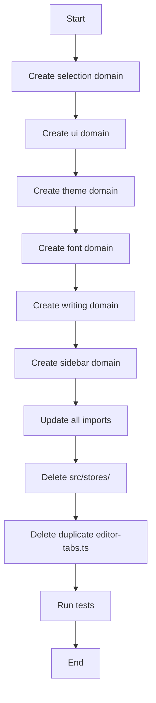

# Design Document: Domain-Driven Architecture Refactoring

## Overview

This document outlines the technical design for refactoring the Grain desktop application to adopt a consistent Domain-Driven Architecture. The refactoring will migrate all legacy Zustand stores from `src/stores/` to a new `src/domain/` directory structure, following the pattern established in `src/domain/editor-tabs/`.

### Goals

1. Establish a consistent module structure across all domains
2. Separate concerns: interfaces, stores, builders, utilities
3. Improve testability through pure functions and clear boundaries
4. Remove duplicate code and legacy patterns

### Non-Goals

1. Backward compatibility with old import paths
2. Changes to the data persistence layer (`src/db/models/`)
3. Changes to the shared editor package (`@grain/editor`)

## Architecture

### Current State

```
src/
├── domain/
│   └── editor-tabs/          # New pattern (target)
│       ├── editor-tabs.interface.ts
│       ├── editor-tabs.store.ts
│       ├── editor-tabs.builder.ts
│       ├── editor-tabs.utils.ts
│       └── index.ts
├── stores/                    # Legacy pattern (to be removed)
│   ├── editor-tabs.ts        # Duplicate!
│   ├── selection.ts
│   ├── ui.ts
│   ├── theme.ts
│   ├── font.ts
│   ├── writing.ts
│   └── unified-sidebar.ts
└── db/models/                 # Repository pattern (keep as-is)
```

### Target State

```
src/
├── domain/
│   ├── editor-tabs/          # Already exists
│   ├── selection/            # New
│   ├── ui/                   # New
│   ├── theme/                # New
│   ├── font/                 # New
│   ├── writing/              # New
│   └── sidebar/              # New (from unified-sidebar)
└── db/models/                 # Unchanged
```

### Domain Module Structure

Each domain module follows this structure:

```
domain/{name}/
├── {name}.interface.ts    # Types, interfaces, constants
├── {name}.store.ts        # Zustand store with Immer
├── {name}.builder.ts      # Builder pattern (optional)
├── {name}.utils.ts        # Pure utility functions (optional)
└── index.ts               # Public API exports
```

## Components and Interfaces

### Selection Domain

```typescript
// selection.interface.ts
export interface SelectionState {
  readonly selectedWorkspaceId: string | null;
  readonly selectedNodeId: string | null;
}

export interface SelectionActions {
  setSelectedWorkspaceId: (id: string | null) => void;
  setSelectedNodeId: (id: string | null) => void;
}
```

### UI Domain

```typescript
// ui.interface.ts
export type RightPanelView = "outline" | "characters" | "drawings" | null;
export type TabPosition = "top" | "right-sidebar";

export interface UIState {
  readonly rightPanelView: RightPanelView;
  readonly rightSidebarOpen: boolean;
  readonly tabPosition: TabPosition;
  readonly locale: string;
}

export interface UIActions {
  setRightPanelView: (view: RightPanelView) => void;
  setRightSidebarOpen: (open: boolean) => void;
  toggleRightSidebar: () => void;
  setTabPosition: (position: TabPosition) => void;
  setLocale: (locale: string) => void;
}
```

### Theme Domain

```typescript
// theme.interface.ts
export type ThemeMode = "light" | "dark" | "system";

export interface ThemeState {
  readonly themeKey: string;
  readonly mode: ThemeMode;
  readonly enableTransition: boolean;
}

export interface ThemeActions {
  setTheme: (key: string) => void;
  setMode: (mode: ThemeMode) => void;
  toggleMode: () => void;
  setEnableTransition: (enable: boolean) => void;
}
```

### Font Domain

```typescript
// font.interface.ts
export interface FontState {
  readonly fontFamily: string;
  readonly fontSize: number;
  readonly lineHeight: number;
  readonly letterSpacing: number;
  readonly uiFontFamily: string;
  readonly uiFontSize: number;
  readonly uiScale: string;
  readonly cardSize: string;
  readonly cardBorderRadius: number;
  readonly paragraphSpacing: number;
  readonly firstLineIndent: number;
}

export interface FontActions {
  setFontFamily: (family: string) => void;
  setFontSize: (size: number) => void;
  setLineHeight: (height: number) => void;
  setLetterSpacing: (spacing: number) => void;
  setUiFontFamily: (family: string) => void;
  setUiFontSize: (size: number) => void;
  setUiScale: (scale: string) => void;
  setCardSize: (size: string) => void;
  setCardBorderRadius: (radius: number) => void;
  setParagraphSpacing: (spacing: number) => void;
  setFirstLineIndent: (indent: number) => void;
  reset: () => void;
}
```

### Writing Domain

```typescript
// writing.interface.ts
export interface WritingGoal {
  readonly dailyTarget: number;
  readonly enabled: boolean;
}

export interface WritingSession {
  readonly startTime: number;
  readonly startWordCount: number;
  readonly currentWordCount: number;
}

export interface WritingState {
  readonly focusMode: boolean;
  readonly typewriterMode: boolean;
  readonly writingGoal: WritingGoal;
  readonly todayWordCount: number;
  readonly todayDate: string;
  readonly session: WritingSession | null;
  readonly minimalToolbar: boolean;
}
```

### Sidebar Domain

```typescript
// sidebar.interface.ts
export type SidebarPanel = "search" | "drawings" | "files" | "tags" | null;

export interface SearchPanelState {
  readonly query: string;
  readonly selectedTypes: readonly string[];
  readonly showFilters: boolean;
}

export interface SidebarState {
  readonly activePanel: SidebarPanel;
  readonly isOpen: boolean;
  readonly width: number;
  readonly wasCollapsedByDrag: boolean;
  readonly previousWidth: number;
  readonly searchState: SearchPanelState;
  readonly fileTreeState: FileTreeState;
}
```

## Data Models

### State Persistence Strategy

| Domain | Persisted Fields | Storage Key |
|--------|------------------|-------------|
| selection | selectedWorkspaceId | grain-selection |
| ui | rightSidebarOpen, tabPosition, locale | grain-ui |
| theme | themeKey, mode, enableTransition | grain-theme |
| font | all settings | grain-font-settings |
| writing | typewriterMode, writingGoal, todayWordCount, todayDate, minimalToolbar | grain-writing |
| sidebar | all state | grain-unified-sidebar |
| editor-tabs | none (empty partialize) | grain-editor-tabs-v2 |

## Correctness Properties

*A property is a characteristic or behavior that should hold true across all valid executions of a system-essentially, a formal statement about what the system should do. Properties serve as the bridge between human-readable specifications and machine-verifiable correctness guarantees.*

### Property 1: Pure Functions Produce Consistent Output
*For any* utility function and any valid input, calling the function multiple times with the same input SHALL produce identical output.
**Validates: Requirements 5.1**

### Property 2: Utility Functions Do Not Mutate Input
*For any* utility function that takes an object as input, the input object SHALL remain unchanged after the function call.
**Validates: Requirements 5.2**

### Property 3: Immutable Updates Return New References
*For any* utility function that performs an update operation, the returned object SHALL be a different reference from the input object.
**Validates: Requirements 5.3**

### Property 4: Builder Method Chaining
*For any* builder instance and any setter method, calling the method SHALL return the same builder instance for chaining.
**Validates: Requirements 4.2**

### Property 5: Builder From Method Round Trip
*For any* valid domain object, creating a builder with `from(object)` and calling `build()` SHALL produce an equivalent object.
**Validates: Requirements 4.3**

### Property 6: Builder Validation
*For any* builder instance missing required fields, calling `build()` SHALL throw an error.
**Validates: Requirements 4.4**

### Property 7: Builder Produces Immutable Objects
*For any* builder instance with valid data, calling `build()` SHALL return a frozen object that cannot be modified.
**Validates: Requirements 4.5**

### Property 8: Store State Persistence Round Trip
*For any* store with persistence enabled, setting state and reloading SHALL restore the persisted fields to their previous values.
**Validates: Requirements 6.3**

### Property 9: Store Partialize Controls Persistence
*For any* store with partialize configured, only the specified fields SHALL be persisted to storage.
**Validates: Requirements 6.5**

### Property 10: Store Migration Preserves Functionality
*For any* migrated store, all original actions SHALL produce the same state changes as before migration.
**Validates: Requirements 2.7**

## Error Handling

### Builder Validation Errors

Builders SHALL throw descriptive errors when required fields are missing:

```typescript
build(): DomainObject {
  if (!this._requiredField) {
    throw new Error("DomainObject requires requiredField");
  }
  // ...
}
```

### Store Action Validation

Store actions SHALL validate inputs and handle edge cases gracefully:

```typescript
setFontSize: (size: number) => {
  // Clamp to valid range instead of throwing
  set({ fontSize: Math.max(12, Math.min(32, size)) });
}
```

## Testing Strategy

### Dual Testing Approach

This refactoring uses both unit tests and property-based tests:

1. **Unit Tests**: Verify specific examples and edge cases
2. **Property-Based Tests**: Verify universal properties across all inputs

### Property-Based Testing Library

- **Library**: fast-check (TypeScript/JavaScript)
- **Minimum Iterations**: 100 per property test
- **Test File Location**: `src/domain/{name}/__tests__/{name}.property.test.ts`

### Test Annotation Format

Each property-based test SHALL be annotated with:
```typescript
/**
 * **Feature: domain-driven-architecture, Property 1: Pure Functions Produce Consistent Output**
 * **Validates: Requirements 5.1**
 */
```

### Unit Test Coverage

Unit tests SHALL cover:
- Store initialization with default values
- Each action's effect on state
- Edge cases (null values, empty strings, boundary values)
- Selector hook return values

### Property Test Coverage

Property tests SHALL verify:
- Utility function purity (Property 1)
- Input immutability (Property 2)
- New reference creation (Property 3)
- Builder method chaining (Property 4)
- Builder round-trip (Property 5)
- Builder validation (Property 6)
- Object immutability (Property 7)
- Persistence round-trip (Property 8)
- Partialize behavior (Property 9)
- Migration correctness (Property 10)

## Migration Sequence



### Import Update Strategy

All imports will be updated from:
```typescript
import { useSelectionStore } from "@/stores/selection";
```

To:
```typescript
import { useSelectionStore } from "@/domain/selection";
```
