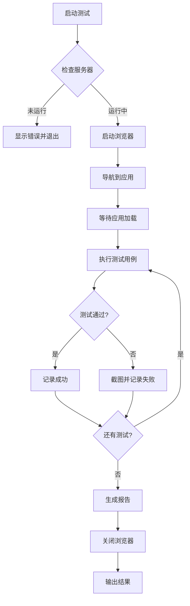

# Design Document: E2E Creation Testing

## Overview

本设计文档描述了使用 Puppeteer 进行 Grain 编辑器 E2E 测试的架构设计。测试覆盖 Diary、Wiki、Ledger 和 Excalidraw 四种文件类型的创建流程。

### 设计目标

1. **可靠性**: 测试应该稳定可重复执行
2. **可维护性**: 测试代码应该易于理解和修改
3. **可扩展性**: 易于添加新的测试用例
4. **问题追踪**: 自动记录发现的问题

### 技术选型

- **测试框架**: Puppeteer (已安装)
- **断言库**: Node.js 内置 assert 或自定义断言
- **报告格式**: Markdown + JSON
- **截图**: PNG 格式

## Architecture

```
apps/desktop/
├── e2e/
│   ├── config/
│   │   └── puppeteer.config.ts      # Puppeteer 配置
│   ├── helpers/
│   │   ├── browser.helper.ts        # 浏览器控制辅助函数
│   │   ├── selectors.ts             # UI 选择器常量
│   │   ├── wait.helper.ts           # 等待策略辅助函数
│   │   └── assert.helper.ts         # 断言辅助函数
│   ├── tests/
│   │   ├── workspace.e2e.ts         # 工作区测试
│   │   ├── diary.e2e.ts             # 日记创建测试
│   │   ├── wiki.e2e.ts              # Wiki 创建测试
│   │   ├── ledger.e2e.ts            # 记账创建测试
│   │   └── excalidraw.e2e.ts        # Excalidraw 创建测试
│   ├── reports/
│   │   ├── issues.md                # 发现的问题记录
│   │   └── screenshots/             # 测试截图
│   └── run-e2e.ts                   # 测试入口文件
└── package.json                     # 添加 e2e 测试脚本
```

## Components and Interfaces

### 1. Puppeteer 配置 (puppeteer.config.ts)

```typescript
export interface PuppeteerConfig {
  readonly headless: boolean;
  readonly slowMo: number;
  readonly defaultViewport: {
    readonly width: number;
    readonly height: number;
  };
  readonly timeout: number;
  readonly baseUrl: string;
}

export const defaultConfig: PuppeteerConfig = {
  headless: true,
  slowMo: 50,
  defaultViewport: { width: 1280, height: 800 },
  timeout: 30000,
  baseUrl: 'http://localhost:5173',
};
```

### 2. UI 选择器 (selectors.ts)

```typescript
export const SELECTORS = {
  // Activity Bar
  activityBar: '[data-testid="activity-bar"]',
  btnNewDiary: '[data-testid="btn-new-diary"]',
  btnNewWiki: '[data-testid="btn-new-wiki"]',
  btnNewLedger: '[data-testid="btn-new-ledger"]',
  workspaceSelector: '[data-testid="workspace-selector"]',
  
  // File Tree
  fileTree: '[data-testid="file-tree"]',
  fileTreeItem: '[data-testid="file-tree-item"]',
  
  // Editor Tabs
  editorTabs: '[data-testid="editor-tabs"]',
  editorTab: '[data-testid="editor-tab"]',
  
  // Toast
  toastContainer: '[data-testid="toast-container"]',
  toastSuccess: '[data-sonner-toast][data-type="success"]',
  toastError: '[data-sonner-toast][data-type="error"]',
  
  // Dialogs
  wikiTitleInput: '[data-testid="wiki-title-input"]',
  confirmButton: '[data-testid="confirm-button"]',
  cancelButton: '[data-testid="cancel-button"]',
} as const;
```

### 3. 浏览器辅助函数 (browser.helper.ts)

```typescript
import type { Browser, Page } from 'puppeteer';

export interface BrowserHelper {
  launch(): Promise<Browser>;
  newPage(browser: Browser): Promise<Page>;
  navigateToApp(page: Page): Promise<void>;
  waitForAppReady(page: Page): Promise<void>;
  screenshot(page: Page, name: string): Promise<string>;
  close(browser: Browser): Promise<void>;
}
```

### 4. 等待策略 (wait.helper.ts)

```typescript
import type { Page } from 'puppeteer';

export interface WaitHelper {
  waitForSelector(page: Page, selector: string, timeout?: number): Promise<void>;
  waitForToast(page: Page, type: 'success' | 'error'): Promise<string>;
  waitForFileTreeItem(page: Page, title: string): Promise<void>;
  waitForEditorTab(page: Page, title: string): Promise<void>;
  waitForNavigation(page: Page): Promise<void>;
}
```

### 5. 测试结果接口

```typescript
export interface TestResult {
  readonly name: string;
  readonly status: 'passed' | 'failed' | 'skipped';
  readonly duration: number;
  readonly error?: string;
  readonly screenshot?: string;
  readonly consoleErrors?: ConsoleError[];
  readonly consoleAnalysis?: string;
  readonly stepScreenshots?: StepScreenshot[];
}

export interface TestReport {
  readonly timestamp: string;
  readonly totalTests: number;
  readonly passed: number;
  readonly failed: number;
  readonly skipped: number;
  readonly results: TestResult[];
  readonly issues: Issue[];
  readonly consoleErrorsSummary: string;
}

export interface Issue {
  readonly id: string;
  readonly description: string;
  readonly stepsToReproduce: string[];
  readonly expectedBehavior: string;
  readonly actualBehavior: string;
  readonly screenshot?: string;
  readonly severity: 'critical' | 'major' | 'minor';
}
```

## Data Models

### 测试用例数据模型

```typescript
export interface TestCase {
  readonly name: string;
  readonly description: string;
  readonly requirements: string[];
  readonly setup?: () => Promise<void>;
  readonly execute: (page: Page) => Promise<void>;
  readonly teardown?: () => Promise<void>;
}
```

### 文件创建验证数据模型

```typescript
export interface FileCreationVerification {
  readonly fileType: 'diary' | 'wiki' | 'ledger' | 'excalidraw';
  readonly expectedFolderStructure: string[];
  readonly expectedFileTitle: string | RegExp;
  readonly expectedToastMessage: string;
}
```

## Correctness Properties

*A property is a characteristic or behavior that should hold true across all valid executions of a system-essentially, a formal statement about what the system should do. Properties serve as the bridge between human-readable specifications and machine-verifiable correctness guarantees.*

由于 E2E 测试主要是验证特定场景的行为，大多数验收标准是具体的示例测试而非属性测试。以下是可以抽象为通用验证的属性：

### Property 1: 文件创建后出现在 File_Tree

*For any* file type (diary, wiki, ledger, excalidraw), when a file is successfully created, the file SHALL appear in the File_Tree within 5 seconds.

**Validates: Requirements 3.3, 4.4, 5.3, 6.3**

### Property 2: 文件创建后自动打开

*For any* file type (diary, wiki, ledger, excalidraw), when a file is successfully created, the file SHALL be automatically opened in Editor_Tabs.

**Validates: Requirements 3.4, 4.5, 5.4, 6.4**

### Property 3: 成功创建显示 Toast

*For any* file type (diary, wiki, ledger, excalidraw), when a file is successfully created, a success Toast message SHALL be displayed.

**Validates: Requirements 3.5, 4.6, 5.5, 6.5**

### Property 4: 未选择工作区时显示错误

*For any* file creation action, if no workspace is selected, an error Toast message SHALL be displayed and no file SHALL be created.

**Validates: Requirements 3.6, 5.6**

## Error Handling

### 每步操作截图策略

**重要**: 每个测试步骤都必须截图，截图保存在 `e2e/reports/screenshots/` 目录下。

```typescript
/**
 * 截图命名规范:
 * {test-name}/{step-number}-{step-description}.png
 * 
 * 例如:
 * diary-creation/01-before-click-button.png
 * diary-creation/02-after-click-button.png
 * diary-creation/03-file-tree-updated.png
 * diary-creation/04-editor-tab-opened.png
 * diary-creation/05-toast-displayed.png
 */

interface StepScreenshot {
  readonly testName: string;
  readonly stepNumber: number;
  readonly stepDescription: string;
  readonly screenshotPath: string;
  readonly timestamp: string;
}

async function screenshotStep(
  page: Page,
  testName: string,
  stepNumber: number,
  stepDescription: string
): Promise<StepScreenshot> {
  const filename = `${String(stepNumber).padStart(2, '0')}-${stepDescription}.png`;
  const dir = `e2e/reports/screenshots/${testName}`;
  const screenshotPath = `${dir}/${filename}`;
  
  // 确保目录存在
  await fs.mkdir(dir, { recursive: true });
  
  // 截图
  await page.screenshot({ path: screenshotPath, fullPage: false });
  
  return {
    testName,
    stepNumber,
    stepDescription,
    screenshotPath,
    timestamp: new Date().toISOString(),
  };
}
```

### 控制台错误捕获

**重要**: 必须捕获并分析开发服务器的控制台错误。

```typescript
interface ConsoleError {
  readonly type: 'error' | 'warning' | 'log';
  readonly message: string;
  readonly timestamp: string;
  readonly stackTrace?: string;
}

/**
 * 设置控制台监听器，捕获所有错误
 */
async function setupConsoleListener(page: Page): Promise<ConsoleError[]> {
  const errors: ConsoleError[] = [];
  
  page.on('console', (msg) => {
    if (msg.type() === 'error' || msg.type() === 'warning') {
      errors.push({
        type: msg.type() as 'error' | 'warning',
        message: msg.text(),
        timestamp: new Date().toISOString(),
        stackTrace: msg.stackTrace()?.map(s => 
          `${s.url}:${s.lineNumber}:${s.columnNumber}`
        ).join('\n'),
      });
    }
  });
  
  // 捕获页面错误
  page.on('pageerror', (error) => {
    errors.push({
      type: 'error',
      message: error.message,
      timestamp: new Date().toISOString(),
      stackTrace: error.stack,
    });
  });
  
  // 捕获请求失败
  page.on('requestfailed', (request) => {
    errors.push({
      type: 'error',
      message: `Request failed: ${request.url()} - ${request.failure()?.errorText}`,
      timestamp: new Date().toISOString(),
    });
  });
  
  return errors;
}

/**
 * 分析控制台错误并生成报告
 */
function analyzeConsoleErrors(errors: ConsoleError[]): string {
  if (errors.length === 0) {
    return '✅ 无控制台错误';
  }
  
  const errorCount = errors.filter(e => e.type === 'error').length;
  const warningCount = errors.filter(e => e.type === 'warning').length;
  
  let report = `## 控制台错误分析\n\n`;
  report += `- 错误数: ${errorCount}\n`;
  report += `- 警告数: ${warningCount}\n\n`;
  
  for (const error of errors) {
    report += `### ${error.type.toUpperCase()} - ${error.timestamp}\n`;
    report += `\`\`\`\n${error.message}\n\`\`\`\n`;
    if (error.stackTrace) {
      report += `\n**Stack Trace:**\n\`\`\`\n${error.stackTrace}\n\`\`\`\n`;
    }
    report += '\n---\n\n';
  }
  
  return report;
}
```

### 测试失败处理

```typescript
async function handleTestFailure(
  page: Page,
  testName: string,
  error: Error,
  consoleErrors: ConsoleError[]
): Promise<TestResult> {
  // 1. 截图保存
  const screenshotPath = await screenshotStep(
    page, 
    testName, 
    99, 
    'failure'
  );
  
  // 2. 记录错误
  logger.error(`[E2E] Test failed: ${testName}`, error);
  
  // 3. 分析控制台错误
  const consoleAnalysis = analyzeConsoleErrors(consoleErrors);
  
  // 4. 返回失败结果
  return {
    name: testName,
    status: 'failed',
    duration: 0,
    error: error.message,
    screenshot: screenshotPath.screenshotPath,
    consoleErrors: consoleErrors,
    consoleAnalysis: consoleAnalysis,
  };
}
```

### 服务器连接失败处理

```typescript
async function checkServerConnection(baseUrl: string): Promise<boolean> {
  try {
    const response = await fetch(baseUrl);
    return response.ok;
  } catch {
    console.error(`
❌ 无法连接到开发服务器 ${baseUrl}

请先启动开发服务器:
  cd apps/desktop
  bun run dev

然后重新运行 E2E 测试。
    `);
    return false;
  }
}
```

## Testing Strategy

### 测试执行流程



### 测试用例组织

1. **Workspace 测试** (workspace.e2e.ts)
   - 验证默认工作区创建
   - 验证 Activity_Bar 显示
   - 验证 File_Tree 显示

2. **Diary 测试** (diary.e2e.ts)
   - 点击按钮创建日记
   - 验证文件夹结构
   - 验证文件出现在 File_Tree
   - 验证自动打开
   - 验证 Toast 消息

3. **Wiki 测试** (wiki.e2e.ts)
   - 点击按钮打开对话框
   - 输入标题并确认
   - 验证文件夹结构
   - 验证文件出现在 File_Tree
   - 验证自动打开
   - 验证 Toast 消息
   - 验证取消创建

4. **Ledger 测试** (ledger.e2e.ts)
   - 点击按钮创建记账
   - 验证文件夹结构
   - 验证文件出现在 File_Tree
   - 验证自动打开
   - 验证 Toast 消息

5. **Excalidraw 测试** (excalidraw.e2e.ts)
   - 触发创建 Excalidraw
   - 验证文件夹结构
   - 验证文件出现在 File_Tree
   - 验证自动打开
   - 验证 Toast 消息

### 问题记录格式

测试过程中发现的问题将记录在 `e2e/reports/issues.md`:

```markdown
# E2E 测试发现的问题

## Issue #1: [问题标题]

**严重程度**: critical | major | minor

**描述**: 
[问题描述]

**复现步骤**:
1. 步骤 1
2. 步骤 2
3. 步骤 3

**期望行为**:
[期望的行为]

**实际行为**:
[实际的行为]

**截图**:


**相关需求**: Requirements X.Y

---
```

## UI 操作规则补充

根据 e2e-testing.md 的要求，测试过程中发现的 UI 操作规则将更新到该文档：

### E2E 文档更新策略

**重要**: 测试完成后必须更新 `.kiro/steering/e2e-testing.md` 文档，记录以下内容：

1. **每步操作截图规范** - 记录截图命名规则和存放位置
2. **控制台错误捕获** - 记录如何捕获和分析开发服务器错误
3. **新发现的选择器** - 记录测试过程中发现的 UI 选择器
4. **等待策略** - 记录各种等待场景的最佳实践
5. **问题记录** - 记录测试过程中发现的问题

### 截图目录结构

```
e2e/reports/
├── screenshots/
│   ├── workspace-init/
│   │   ├── 01-app-loaded.png
│   │   ├── 02-workspace-created.png
│   │   └── 03-file-tree-visible.png
│   ├── diary-creation/
│   │   ├── 01-before-click.png
│   │   ├── 02-after-click.png
│   │   ├── 03-folder-structure.png
│   │   ├── 04-file-in-tree.png
│   │   ├── 05-editor-tab.png
│   │   └── 06-toast-message.png
│   ├── wiki-creation/
│   │   └── ...
│   ├── ledger-creation/
│   │   └── ...
│   └── excalidraw-creation/
│       └── ...
├── issues.md
├── console-errors.md
└── test-report.json
```

### 待添加的 data-testid

根据需求 7，以下组件需要添加 data-testid：

| 组件 | data-testid | 文件位置 |
|------|-------------|----------|
| Activity Bar | `activity-bar` | `activity-bar.view.fn.tsx` |
| New Diary 按钮 | `btn-new-diary` | `activity-bar.view.fn.tsx` |
| New Wiki 按钮 | `btn-new-wiki` | `activity-bar.view.fn.tsx` |
| New Ledger 按钮 | `btn-new-ledger` | `activity-bar.view.fn.tsx` |
| File Tree | `file-tree` | `file-tree.view.fn.tsx` |
| File Tree Item | `file-tree-item` | `file-tree-item.tsx` |
| Editor Tabs | `editor-tabs` | `editor-tabs.view.fn.tsx` |
| Editor Tab | `editor-tab` | `editor-tab.tsx` |

### 测试执行命令

```bash
# 运行所有 E2E 测试
bun run e2e

# 运行特定测试
bun run e2e:diary
bun run e2e:wiki
bun run e2e:ledger
bun run e2e:excalidraw

# 以非无头模式运行（可视化调试）
bun run e2e:debug
```


## E2E 文档更新任务

测试完成后，必须更新 `.kiro/steering/e2e-testing.md` 文档，添加以下内容：

### 1. 截图规范

```markdown
## 截图规范

### 命名规则
- 格式: `{step-number}-{step-description}.png`
- 步骤编号使用两位数字，如 `01`, `02`
- 描述使用小写字母和连字符

### 存放位置
- 基础目录: `apps/desktop/e2e/reports/screenshots/`
- 每个测试用例一个子目录
- 失败截图使用 `99-failure.png`

### 截图时机
- 每个操作前后都要截图
- 等待元素出现后截图
- 验证结果时截图
```

### 2. 控制台错误捕获

```markdown
## 控制台错误捕获

### 捕获类型
- `console.error` - 错误日志
- `console.warn` - 警告日志
- `pageerror` - 页面 JavaScript 错误
- `requestfailed` - 网络请求失败

### 分析报告
- 错误数量统计
- 错误详情和堆栈
- 保存到 `e2e/reports/console-errors.md`
```

### 3. 发现的问题模板

```markdown
## Issue #N: [问题标题]

**发现时间**: YYYY-MM-DD HH:mm:ss
**严重程度**: critical | major | minor
**测试用例**: [测试用例名称]

**描述**: 
[问题描述]

**复现步骤**:
1. 步骤 1
2. 步骤 2
3. 步骤 3

**期望行为**:
[期望的行为]

**实际行为**:
[实际的行为]

**控制台错误**:
\`\`\`
[相关的控制台错误]
\`\`\`

**截图**:


**相关需求**: Requirements X.Y
```
