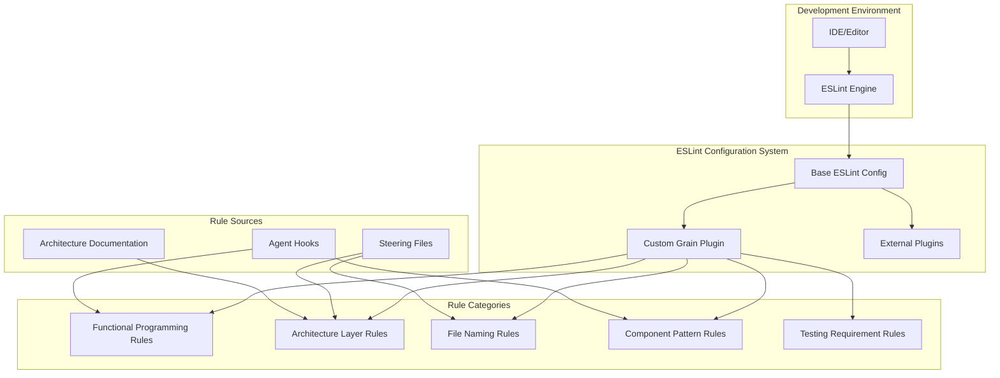

# Design Document

## Overview

This design outlines the integration of all agent hooks and steering file rules into a comprehensive ESLint configuration system for the Grain project. The system will automatically enforce functional programming patterns, architectural layer separation, file naming conventions, and component design patterns during development.

The solution combines existing ESLint plugins with custom rules to create a unified linting experience that replaces manual code reviews with automated enforcement of architectural principles.

## Architecture

### High-Level Architecture



### Plugin Architecture

The system consists of three main components:

1. **Enhanced Base Configuration**: Extended version of the current `.eslintrc.functional.js` with comprehensive rule coverage
2. **Custom Grain Plugin**: New ESLint plugin (`eslint-plugin-grain`) containing Grain-specific rules
3. **External Plugin Integration**: Leveraging existing plugins like `eslint-plugin-check-file` and `eslint-plugin-functional`

## Components and Interfaces

### 1. Enhanced ESLint Configuration

**File**: `apps/desktop/.eslintrc.functional.js`

Enhanced configuration that integrates all rule categories with directory-specific overrides:

```typescript
interface ESLintConfig {
  root: boolean;
  env: Record<string, boolean>;
  parser: string;
  parserOptions: ParserOptions;
  plugins: string[];
  extends: string[];
  rules: Record<string, RuleConfig>;
  overrides: Override[];
}

interface Override {
  files: string[];
  rules: Record<string, RuleConfig>;
  excludedFiles?: string[];
}

interface RuleConfig {
  level: 'error' | 'warn' | 'off';
  options?: any[];
}
```

### 2. Custom Grain ESLint Plugin

**File**: `apps/desktop/eslint-plugin-grain/index.js`

Custom plugin containing Grain-specific rules:

```typescript
interface GrainPlugin {
  rules: Record<string, ESLintRule>;
  configs: Record<string, ESLintConfig>;
}

interface ESLintRule {
  meta: RuleMeta;
  create: (context: RuleContext) => RuleListener;
}

interface RuleMeta {
  type: 'problem' | 'suggestion' | 'layout';
  docs: {
    description: string;
    category: string;
    recommended: boolean;
    url?: string;
  };
  fixable?: 'code' | 'whitespace';
  schema: JSONSchema;
  messages: Record<string, string>;
}
```

### 3. Rule Categories

#### Functional Programming Rules
- `grain/no-try-catch`: Prohibit try-catch, suggest TaskEither
- `grain/no-console-log`: Prohibit console.log, suggest logger
- `grain/no-date-constructor`: Prohibit Date(), suggest dayjs
- `grain/no-lodash`: Prohibit lodash, suggest es-toolkit
- `grain/no-mutation`: Prohibit array.push() and object mutation
- `grain/prefer-pipe`: Suggest pipe() for nested function calls
- `grain/no-promise-catch`: Prohibit Promise.catch(), suggest TaskEither.tryCatch()
- `grain/no-throw`: Prohibit throw, suggest TaskEither.left()

#### Architecture Layer Rules
- `grain/layer-dependencies`: Enforce directory dependency rules
- `grain/no-react-in-pure-layers`: Prohibit React in pipes/, utils/, io/, state/
- `grain/no-side-effects-in-pipes`: Prohibit side effects in pipes/
- `grain/container-view-separation`: Enforce container/view component separation

#### File Naming Rules
- `grain/pipe-file-naming`: Require .pipe.ts suffix in pipes/
- `grain/flow-file-naming`: Require .flow.ts suffix in flows/
- `grain/api-file-naming`: Require .api.ts suffix in io/api/
- `grain/storage-file-naming`: Require .storage.ts suffix in io/storage/
- `grain/state-file-naming`: Require .state.ts suffix in state/
- `grain/hook-file-naming`: Require use-*.ts pattern in hooks/
- `grain/view-file-naming`: Require .view.fn.tsx or .container.fn.tsx in views/
- `grain/util-file-naming`: Require .util.ts suffix in utils/

#### Component Pattern Rules
- `grain/no-store-in-views`: Prohibit direct store access in view components
- `grain/require-memo`: Require memo() wrapper for components
- `grain/view-props-only`: Ensure view components only use props

#### Testing Requirement Rules
- `grain/require-fn-tests`: Require .fn.test.ts for .fn.ts files
- `grain/require-flow-tests`: Require .flow.test.ts for .flow.ts files
- `grain/require-pipe-tests`: Require .pipe.test.ts for .pipe.ts files
- `grain/require-component-tests`: Suggest test files for components

### 4. External Plugin Integration

#### eslint-plugin-check-file
For file and folder naming conventions:

```javascript
'check-file/filename-naming-convention': [
  'error',
  {
    '**/*.{ts,tsx}': 'KEBAB_CASE',
    'src/pipes/**/*.ts': '+(.+).pipe.ts',
    'src/flows/**/*.ts': '+(.+).flow.ts',
    'src/io/api/**/*.ts': '+(.+).api.ts',
    'src/io/storage/**/*.ts': '+(.+).storage.ts',
    'src/state/**/*.ts': '+(.+).state.ts',
    'src/hooks/**/*.ts': 'use-+(.+).ts',
    'src/views/**/*.tsx': '+(.+).view.fn.tsx|+(.+).container.fn.tsx',
    'src/utils/**/*.ts': '+(.+).util.ts'
  }
]
```

#### eslint-plugin-functional
For functional programming enforcement:

```javascript
'functional/no-mutation': 'error',
'functional/prefer-readonly-type': 'error',
'functional/no-method-signature': 'error',
'functional/no-this-expression': 'error'
```

## Data Models

### Rule Configuration Schema

```typescript
interface GrainRuleConfig {
  // Functional Programming Rules
  functionalProgramming: {
    noTryCatch: boolean;
    noConsoleLog: boolean;
    noDateConstructor: boolean;
    noLodash: boolean;
    noMutation: boolean;
    preferPipe: boolean;
    noPromiseCatch: boolean;
    noThrow: boolean;
  };
  
  // Architecture Rules
  architecture: {
    layerDependencies: LayerDependencyConfig;
    noReactInPureLayers: boolean;
    noSideEffectsInPipes: boolean;
    containerViewSeparation: boolean;
  };
  
  // File Naming Rules
  fileNaming: {
    enforceConventions: boolean;
    strictMode: boolean;
  };
  
  // Component Rules
  components: {
    noStoreInViews: boolean;
    requireMemo: boolean;
    viewPropsOnly: boolean;
  };
  
  // Testing Rules
  testing: {
    requireFnTests: boolean;
    requireFlowTests: boolean;
    requirePipeTests: boolean;
    suggestComponentTests: boolean;
  };
}

interface LayerDependencyConfig {
  views: string[];      // ['hooks', 'types']
  hooks: string[];      // ['flows', 'state', 'queries', 'types']
  flows: string[];      // ['pipes', 'io', 'state', 'types']
  pipes: string[];      // ['utils', 'types']
  io: string[];         // ['types']
  state: string[];      // ['types', 'pipes'] (theme.state exception)
  utils: string[];      // ['types']
  types: string[];      // []
}
```

### Error Message Templates

```typescript
interface ErrorMessageTemplates {
  noTryCatch: {
    message: string;
    suggestion: string;
    example: string;
    documentation: string;
  };
  layerViolation: {
    message: string;
    allowedDependencies: string[];
    violatingImport: string;
    suggestion: string;
  };
  fileNaming: {
    message: string;
    currentName: string;
    expectedPattern: string;
    examples: string[];
  };
}
```

## Correctness Properties

*A property is a characteristic or behavior that should hold true across all valid executions of a system-essentially, a formal statement about what the system should do. Properties serve as the bridge between human-readable specifications and machine-verifiable correctness guarantees.*

### Property 1: Try-catch prohibition enforcement
*For any* TypeScript file in the Grain project, when try-catch statements are used, ESLint should report an error with TaskEither usage suggestions
**Validates: Requirements 1.1**

### Property 2: Console.log prohibition enforcement
*For any* TypeScript file in the Grain project, when console.log is used, ESLint should report an error with logger usage suggestions and proper format examples
**Validates: Requirements 1.2**

### Property 3: Date constructor prohibition enforcement
*For any* TypeScript file in the Grain project, when Date() or Date.now() is used, ESLint should report an error with dayjs usage suggestions
**Validates: Requirements 1.3**

### Property 4: Lodash import prohibition enforcement
*For any* TypeScript file in the Grain project, when lodash imports are used, ESLint should report an error with es-toolkit alternatives
**Validates: Requirements 1.4**

### Property 5: Mutation operation prohibition enforcement
*For any* TypeScript file in the Grain project, when array.push() or direct object mutations are used, ESLint should report an error with immutable operation suggestions
**Validates: Requirements 1.5**

### Property 6: Architecture layer dependency enforcement
*For any* TypeScript file in the Grain project, when imports violate layer dependency rules, ESLint should report specific architectural violation errors
**Validates: Requirements 1.6**

### Property 7: Pure layer React prohibition
*For any* TypeScript file in pipes/, utils/, io/, or state/ directories, when React imports are used, ESLint should report architecture violations
**Validates: Requirements 2.1, 2.4, 2.5, 2.6, 2.7, 2.8**

### Property 8: View layer dependency restriction
*For any* TypeScript file in views/ directory (excluding containers), when imports from io/, flows/, pipes/, or state/ are used, ESLint should report dependency violations
**Validates: Requirements 2.2**

### Property 9: Hook layer dependency restriction
*For any* TypeScript file in hooks/ directory, when imports from views/ or routes/ are used, ESLint should report dependency violations
**Validates: Requirements 2.3**

### Property 10: File naming convention enforcement
*For any* TypeScript file in specific directories (pipes/, flows/, io/, state/, hooks/, views/, utils/), when the filename doesn't match the required pattern, ESLint should report naming violations
**Validates: Requirements 3.1, 3.2, 3.3, 3.4, 3.5, 3.6, 3.7, 3.8**

### Property 11: Nested function call detection
*For any* TypeScript file with deeply nested function calls (3+ levels), ESLint should suggest pipe() usage for better readability
**Validates: Requirements 4.1**

### Property 12: Promise.catch prohibition enforcement
*For any* TypeScript file in the Grain project, when Promise.catch() is used, ESLint should suggest TaskEither.tryCatch() alternatives
**Validates: Requirements 4.2**

### Property 13: Throw statement prohibition enforcement
*For any* TypeScript file in the Grain project, when throw statements are used, ESLint should suggest TaskEither.left() alternatives
**Validates: Requirements 4.3**

### Property 14: Async/await with try-catch detection
*For any* async function with try-catch blocks, ESLint should suggest TaskEither pipeline usage
**Validates: Requirements 4.4**

### Property 15: Global object access in pure layers
*For any* TypeScript file in pipes/ or utils/ directories, when global objects (window, document, localStorage) are accessed, ESLint should report side effect violations
**Validates: Requirements 4.5**

### Property 16: Store access in view components
*For any* view component file (.view.fn.tsx), when store access patterns are detected, ESLint should report architecture violations
**Validates: Requirements 5.1**

### Property 17: Component memo pattern enforcement
*For any* React component that doesn't use memo() wrapper, ESLint should suggest performance optimization
**Validates: Requirements 5.4**

### Property 18: Test file requirement enforcement
*For any* .fn.ts, .flow.ts, or .pipe.ts file, when corresponding test files don't exist, ESLint should require their creation
**Validates: Requirements 6.1, 6.2, 6.3**

### Property 19: Component test file suggestion
*For any* view component file, when corresponding test files don't exist, ESLint should suggest their creation
**Validates: Requirements 6.4**

### Property 20: Import grouping enforcement
*For any* TypeScript file with imports, external library imports should be grouped separately from internal imports
**Validates: Requirements 7.1**

### Property 21: Internal import alias enforcement
*For any* internal module import, ESLint should enforce @/ prefix usage
**Validates: Requirements 7.2**

### Property 22: Deprecated module detection
*For any* import from deprecated modules, ESLint should suggest modern alternatives
**Validates: Requirements 7.4**

### Property 23: ESLint performance requirement
*For any* typical file change, ESLint should complete linting within 2 seconds
**Validates: Requirements 9.1**

### Property 24: Batch processing optimization
*For any* multiple file linting operation, rules should be optimized for efficient batch processing
**Validates: Requirements 9.2**

### Property 25: Rule debugging information availability
*For any* rule execution, detailed debugging information should be available when requested
**Validates: Requirements 10.4**

### Property 26: Configuration validation completeness
*For any* configuration change, the system should validate rule consistency and completeness
**Validates: Requirements 10.5**

## Error Handling

### Error Categories

1. **Rule Execution Errors**: Handle cases where custom rules fail during AST analysis
2. **Configuration Errors**: Handle invalid ESLint configuration or plugin loading failures
3. **Performance Errors**: Handle cases where rules exceed performance thresholds
4. **File System Errors**: Handle cases where test file existence checks fail

### Error Recovery Strategies

```typescript
interface ErrorRecovery {
  ruleExecutionError: {
    strategy: 'skip-rule' | 'fallback-rule' | 'disable-temporarily';
    logging: boolean;
    userNotification: boolean;
  };
  
  configurationError: {
    strategy: 'use-defaults' | 'fail-fast' | 'partial-config';
    validation: boolean;
    recovery: boolean;
  };
  
  performanceError: {
    strategy: 'optimize-rules' | 'reduce-scope' | 'async-processing';
    monitoring: boolean;
    alerting: boolean;
  };
}
```

### Graceful Degradation

- If custom rules fail, fall back to base ESLint configuration
- If file system checks fail, skip test requirement rules
- If performance thresholds are exceeded, reduce rule scope or disable heavy rules
- Provide clear error messages with recovery suggestions

## Testing Strategy

### Dual Testing Approach

The testing strategy combines unit tests for specific rule behaviors with property-based tests for comprehensive coverage:

**Unit Tests**:
- Test specific AST pattern detection (try-catch, console.log, mutations)
- Test directory-based rule application
- Test error message generation and formatting
- Test configuration validation logic
- Test file naming pattern matching

**Property-Based Tests**:
- Generate random TypeScript code samples and verify rule application
- Test rule performance across various file sizes and complexity
- Verify rule consistency across different code patterns
- Test configuration combinations for completeness

### Testing Framework Configuration

Using Jest with custom AST testing utilities:

```typescript
// Test configuration for property-based testing
const propertyTestConfig = {
  iterations: 100, // Minimum iterations per property test
  timeout: 5000,   // Maximum test execution time
  generators: {
    typescript: 'custom-ts-generator',
    imports: 'import-pattern-generator',
    components: 'react-component-generator'
  }
};

// Tag format for property tests
// Feature: eslint-rules-integration, Property 1: Try-catch prohibition enforcement
```

### Test File Organization

```
apps/desktop/eslint-plugin-grain/
├── __tests__/
│   ├── rules/
│   │   ├── functional-programming.test.ts
│   │   ├── architecture-layers.test.ts
│   │   ├── file-naming.test.ts
│   │   ├── component-patterns.test.ts
│   │   └── testing-requirements.test.ts
│   ├── integration/
│   │   ├── full-config.test.ts
│   │   └── performance.test.ts
│   └── fixtures/
│       ├── valid-code/
│       └── invalid-code/
```

### Performance Testing

- Benchmark rule execution time against performance requirements
- Test memory usage during batch processing
- Verify IDE integration responsiveness
- Monitor rule execution overhead in CI/CD pipelines

The testing strategy ensures that all correctness properties are validated through automated tests, providing confidence in the rule implementation and maintaining the architectural integrity of the Grain project.