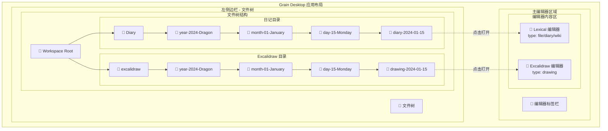
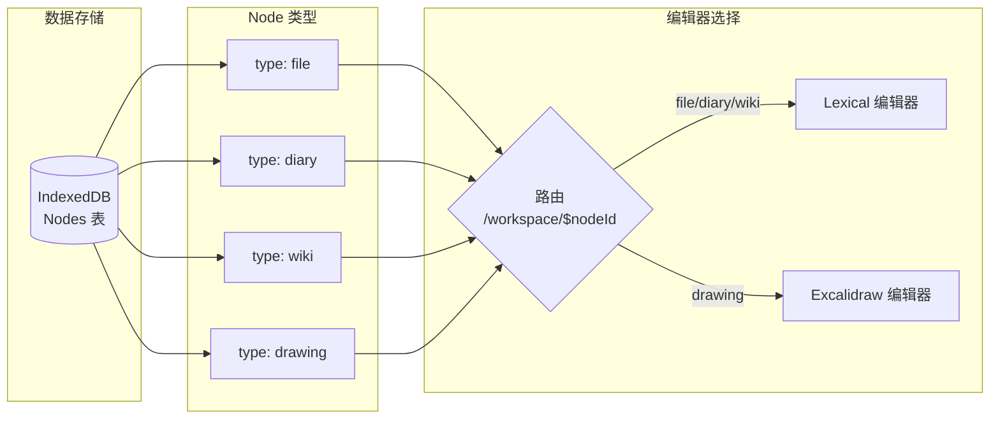
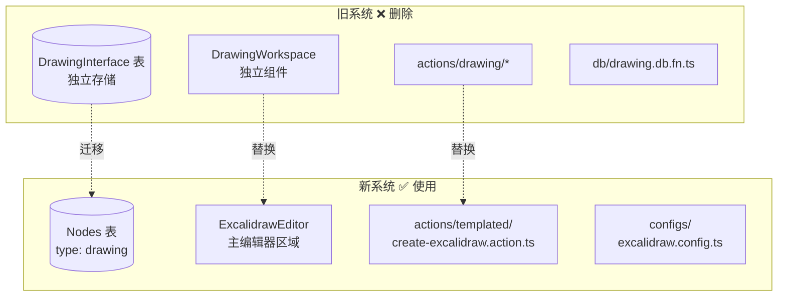

# Design Document

## Overview

本设计文档描述了如何将现有的 drawing 模块重构为基于文件树的 Excalidraw 文件管理系统。新系统将遵循与日记功能相同的模板化文件创建模式，使用高阶函数和配置驱动的方式。

**核心设计理念：**
- Excalidraw 文件作为普通节点存储在文件树中（类型为 `drawing`）
- 文件存储在 `excalidraw/` 根目录下
- 点击文件树中的 Excalidraw 文件，在主编辑器区域打开（占据编辑器位置）
- 完全删除旧的独立 drawing 系统（DrawingInterface 表、DrawingWorkspace 组件等）

## Architecture

### 应用布局



### 路由与编辑器选择



### 新旧系统对比



### 数据流

```
用户操作 (命令面板/文件树右键)
    ↓
createExcalidraw Action
    ↓
createTemplatedFile (高阶函数)
    ↓
excalidrawConfig (配置)
    ↓
生成 Excalidraw JSON 内容
    ↓
createFileInTree
    ↓
保存到 IndexedDB (作为 Node，类型为 drawing)
    ↓
更新文件树显示
    ↓
用户点击文件树中的 Excalidraw 文件
    ↓
路由跳转到 /workspace/$nodeId
    ↓
编辑器区域加载 Excalidraw 组件
    ↓
显示和编辑 Excalidraw 内容
```

### 目录结构

```
src/
├── actions/
│   └── templated/
│       ├── configs/
│       │   ├── diary.config.ts          # 现有
│       │   ├── wiki.config.ts           # 现有
│       │   └── excalidraw.config.ts     # 新增
│       ├── create-diary.action.ts       # 现有
│       ├── create-wiki.action.ts        # 现有
│       ├── create-excalidraw.action.ts  # 新增
│       └── create-templated-file.action.ts  # 现有
│
├── fn/
│   └── content/
│       ├── diary.content.fn.ts          # 现有
│       ├── wiki.content.fn.ts           # 现有
│       └── excalidraw.content.fn.ts     # 新增
│
├── components/
│   └── excalidraw-editor/               # 新增
│       ├── excalidraw-editor.view.fn.tsx
│       ├── excalidraw-editor.container.fn.tsx
│       ├── excalidraw-editor.types.ts
│       └── index.ts
│
└── routes/
    └── workspace/
        └── $nodeId.tsx                  # 更新：根据节点类型渲染不同编辑器
```

### 删除的文件和代码

```
components/
└── drawing/
    └── drawing-workspace.tsx            # 删除（旧的独立组件）

actions/
└── drawing/
    ├── create-drawing.action.ts         # 删除
    ├── delete-drawing.action.ts         # 删除
    ├── rename-drawing.action.ts         # 删除
    ├── save-drawing-content.action.ts   # 删除
    └── index.ts                         # 删除

db/
├── drawing.db.fn.ts                     # 删除（所有 drawing 相关函数）
└── schema.ts                            # 删除 DrawingInterface 定义

panels/
└── drawings-panel.tsx                   # 删除（如果存在）
```

## Components and Interfaces

### 1. Excalidraw 编辑器组件

**文件**: `src/components/excalidraw-editor/excalidraw-editor.view.fn.tsx`

这是一个新的编辑器组件，用于在主编辑器区域显示和编辑 Excalidraw 内容。

```typescript
import { memo } from "react";
import { Excalidraw } from "@excalidraw/excalidraw";
import type { ExcalidrawEditorViewProps } from "./excalidraw-editor.types";

export const ExcalidrawEditorView = memo(({
  initialData,
  theme,
  onChange,
  onSave,
}: ExcalidrawEditorViewProps) => {
  return (
    <div className="h-full w-full">
      <Excalidraw
        initialData={initialData}
        theme={theme}
        onChange={onChange}
        UIOptions={{
          canvasActions: {
            export: true,
            loadScene: false,
            saveToActiveFile: false,
          },
        }}
      />
    </div>
  );
});

ExcalidrawEditorView.displayName = "ExcalidrawEditorView";
```

**文件**: `src/components/excalidraw-editor/excalidraw-editor.container.fn.tsx`

```typescript
import { memo, useCallback, useEffect, useState } from "react";
import { useParams } from "@tanstack/react-router";
import { ExcalidrawEditorView } from "./excalidraw-editor.view.fn";
import { useNode } from "@/hooks/use-node";
import { updateNodeContent } from "@/actions/node";
import { useTheme } from "@/hooks/use-theme";

export const ExcalidrawEditorContainer = memo(() => {
  const { nodeId } = useParams({ from: "/workspace/$nodeId" });
  const node = useNode(nodeId);
  const { isDark } = useTheme();
  
  const [initialData, setInitialData] = useState(null);
  
  useEffect(() => {
    if (node?.content) {
      try {
        const parsed = JSON.parse(node.content);
        setInitialData(parsed);
      } catch (error) {
        console.error("Failed to parse Excalidraw data:", error);
        setInitialData({ elements: [], appState: {}, files: {} });
      }
    }
  }, [node?.content]);
  
  const handleChange = useCallback((elements, appState, files) => {
    // Auto-save logic
    const dataToSave = {
      elements,
      appState: {
        viewBackgroundColor: appState.viewBackgroundColor,
        gridSize: appState.gridSize,
      },
      files,
    };
    
    // Debounced save
    const timeoutId = setTimeout(() => {
      updateNodeContent(nodeId, JSON.stringify(dataToSave));
    }, 2000);
    
    return () => clearTimeout(timeoutId);
  }, [nodeId]);
  
  if (!node || !initialData) {
    return <div>Loading...</div>;
  }
  
  return (
    <ExcalidrawEditorView
      initialData={initialData}
      theme={isDark ? "dark" : "light"}
      onChange={handleChange}
    />
  );
});

ExcalidrawEditorContainer.displayName = "ExcalidrawEditorContainer";
```

### 2. Excalidraw 模板配置

### 2. Excalidraw 模板配置

**文件**: `src/actions/templated/configs/excalidraw.config.ts`

```typescript
import { z } from "zod";
import { generateExcalidrawContent } from "@/fn/content";
import { getDateFolderStructureWithFilename } from "@/fn/date";
import type { TemplateConfig } from "../create-templated-file.action";

export interface ExcalidrawTemplateParams {
  readonly title?: string;
  readonly date?: Date;
  readonly width?: number;
  readonly height?: number;
}

export const excalidrawParamsSchema = z.object({
  title: z.string().optional(),
  date: z.date().optional(),
  width: z.number().optional(),
  height: z.number().optional(),
});

const generateExcalidrawTemplate = (params: ExcalidrawTemplateParams): string => {
  return generateExcalidrawContent({
    width: params.width || 1920,
    height: params.height || 1080,
  });
};

/**
 * 生成 Excalidraw 文件夹路径（年/月/日结构）
 */
const generateExcalidrawFolderPath = (params: ExcalidrawTemplateParams): string[] => {
  const date = params.date || dayjs().toDate();
  const structure = getDateFolderStructureWithFilename(date, "drawing");

  return [structure.yearFolder, structure.monthFolder, structure.dayFolder];
};

/**
 * 生成 Excalidraw 文件标题
 */
const generateExcalidrawTitle = (params: ExcalidrawTemplateParams): string => {
  if (params.title) {
    return params.title;
  }
  const date = params.date || dayjs().toDate();
  const structure = getDateFolderStructureWithFilename(date, "drawing");
  return structure.filename; // 例如: drawing-2024-01-15
};

export const excalidrawConfig: TemplateConfig<ExcalidrawTemplateParams> = {
  name: "Excalidraw Drawing",
  rootFolder: "excalidraw",
  fileType: "drawing",
  tag: "excalidraw",
  generateTemplate: generateExcalidrawTemplate,
  generateFolderPath: generateExcalidrawFolderPath,
  generateTitle: generateExcalidrawTitle,
  paramsSchema: excalidrawParamsSchema,
  foldersCollapsed: true,
};
```

### 3. Excalidraw 内容生成函数

**文件**: `src/fn/content/excalidraw.content.fn.ts`

```typescript
export interface ExcalidrawContentParams {
  readonly width?: number;
  readonly height?: number;
}

export const generateExcalidrawContent = (
  params: ExcalidrawContentParams = {}
): string => {
  const width = params.width || 1920;
  const height = params.height || 1080;

  const excalidrawData = {
    type: "excalidraw",
    version: 2,
    source: "grain-editor",
    elements: [],
    appState: {
      viewBackgroundColor: "#ffffff",
      currentItemStrokeColor: "#000000",
      currentItemBackgroundColor: "transparent",
      currentItemFillStyle: "hachure",
      currentItemStrokeWidth: 1,
      currentItemStrokeStyle: "solid",
      currentItemRoughness: 1,
      currentItemOpacity: 100,
      currentItemFontFamily: 1,
      currentItemFontSize: 20,
      currentItemTextAlign: "left",
      currentItemStartArrowhead: null,
      currentItemEndArrowhead: "arrow",
      scrollX: 0,
      scrollY: 0,
      zoom: { value: 1 },
      currentItemRoundness: "round",
      gridSize: null,
      colorPalette: {},
    },
    files: {},
  };

  return JSON.stringify(excalidrawData, null, 2);
};
```

### 4. Excalidraw 创建 Action

**文件**: `src/actions/templated/create-excalidraw.action.ts`

```typescript
import { excalidrawConfig, type ExcalidrawTemplateParams } from "./configs/excalidraw.config";
import {
  createTemplatedFile,
  createTemplatedFileAsync,
  type TemplatedFileParams,
  type TemplatedFileResult,
} from "./create-templated-file.action";

export interface CreateExcalidrawParams {
  readonly workspaceId: string;
  readonly title?: string;
  readonly date?: Date;
  readonly width?: number;
  readonly height?: number;
}

export interface ExcalidrawCreationResult {
  readonly node: import("@/types/node").NodeInterface;
  readonly content: string;
  readonly parsedContent: unknown;
}

export const createExcalidraw = createTemplatedFile(excalidrawConfig);

export const createExcalidrawAsync = createTemplatedFileAsync(excalidrawConfig);

export const adaptExcalidrawParams = (
  params: CreateExcalidrawParams
): TemplatedFileParams<ExcalidrawTemplateParams> => ({
  workspaceId: params.workspaceId,
  templateParams: {
    title: params.title,
    date: params.date,
    width: params.width,
    height: params.height,
  },
});

export const createExcalidrawCompat = (
  params: CreateExcalidrawParams
): ReturnType<typeof createExcalidraw> => {
  const adaptedParams = adaptExcalidrawParams(params);
  return createExcalidraw(adaptedParams);
};

export async function createExcalidrawCompatAsync(
  params: CreateExcalidrawParams
): Promise<ExcalidrawCreationResult> {
  const adaptedParams = adaptExcalidrawParams(params);
  return createExcalidrawAsync(adaptedParams);
}
```

### 5. 路由集成

**文件**: `src/routes/workspace/$nodeId.tsx`

需要更新路由组件，根据节点类型渲染不同的编辑器：

```typescript
// 在路由组件中
const renderEditor = () => {
  if (!node) return <div>Loading...</div>;
  
  switch (node.type) {
    case "drawing":
      return <ExcalidrawEditorContainer />;
    case "diary":
    case "file":
    case "wiki":
      return <LexicalEditorContainer />;
    default:
      return <div>Unsupported file type</div>;
  }
};
```

## Data Models

### Excalidraw Node（文件树节点）

Excalidraw 文件使用现有的 `NodeInterface`，作为文件树中的普通节点：

```typescript
interface NodeInterface {
  id: string;
  type: "drawing";           // 节点类型为 drawing
  title: string;             // 文件名
  content: string;           // Excalidraw JSON 字符串
  tags: string[];            // 包含 "excalidraw" 标签
  workspaceId: string;       // 所属工作区
  parentId: string | null;   // 父节点 ID（excalidraw 根文件夹）
  // ... 其他 Node 字段
}
```

**关键点：**
- ✅ 使用现有的 Node 系统，不需要独立的 DrawingInterface 表
- ✅ 存储在文件树中，可以像其他文件一样管理（重命名、删除、移动）
- ✅ 内容存储在 `content` 字段，格式为 Excalidraw JSON 字符串
- ✅ 通过 `parentId` 关联到 `excalidraw/` 根文件夹

### Excalidraw JSON 结构

```typescript
interface ExcalidrawData {
  type: "excalidraw";
  version: number;
  source: string;
  elements: ExcalidrawElement[];
  appState: ExcalidrawAppState;
  files: Record<string, ExcalidrawFile>;
}
```

## Correctness Properties

*A property is a characteristic or behavior that should hold true across all valid executions of a system-essentially, a formal statement about what the system should do. Properties serve as the bridge between human-readable specifications and machine-verifiable correctness guarantees.*

### Property 1: Excalidraw 文件创建在正确目录结构

*For any* Excalidraw file creation request, the created file should be located under the `excalidraw/` root folder with year/month/day subfolder structure (e.g., `excalidraw/year-2024-Dragon/month-01-January/day-15-Monday/`).

**Validates: Requirements 2.3, 2.7, 3.5**

### Property 2: Excalidraw 内容格式有效

*For any* generated Excalidraw content, parsing it as JSON should succeed and contain required fields (type, version, elements, appState, files).

**Validates: Requirements 4.2, 4.3, 4.4**

### Property 3: 模板配置一致性

*For any* Excalidraw template configuration, it should follow the same pattern as diary and wiki configs (rootFolder, fileType, tag, generate functions).

**Validates: Requirements 2.2, 2.3, 2.4, 2.5**

### Property 4: 文件创建幂等性

*For any* Excalidraw file creation with the same title, each creation should generate a unique file (different ID or timestamp-based title).

**Validates: Requirements 3.6, 2.8**

### Property 5: 旧代码完全移除

*For any* search of "drawing" related imports, no references to deleted files (`actions/drawing/*`, `components/drawing/*`, `db/drawing.db.fn.ts`) should exist.

**Validates: Requirements 1.1, 1.2, 1.3, 1.5**

## Error Handling

### 错误类型

| 错误场景 | 错误类型 | 处理方式 |
|---------|---------|---------|
| 工作区不存在 | `WorkspaceNotFoundError` | 返回 Left，显示错误提示 |
| 文件创建失败 | `FileCreationError` | 返回 Left，显示错误提示 |
| JSON 解析失败 | `ParseError` | 返回 Left，使用默认空内容 |
| 参数校验失败 | `ValidationError` | 返回 Left，显示参数错误 |

### 错误处理流程

```typescript
pipe(
  TE.Do,
  TE.bind("validated", () => validateParams(params)),
  TE.chain(({ validated }) => createFileInTree(validated)),
  TE.mapLeft((error) => {
    logger.error("[Excalidraw] Creation failed:", error);
    return error;
  })
);
```

## Testing Strategy

### Unit Tests

**测试文件**:
- `excalidraw.config.test.ts` - 测试配置正确性
- `excalidraw.content.fn.test.ts` - 测试内容生成
- `create-excalidraw.action.test.ts` - 测试 Action 逻辑

**测试用例**:
1. 配置测试
   - 验证 rootFolder 为 "excalidraw"
   - 验证 fileType 为 "drawing"
   - 验证 tag 为 "excalidraw"
   - 验证生成函数存在且可调用

2. 内容生成测试
   - 验证生成的 JSON 可解析
   - 验证包含必需字段
   - 验证默认尺寸正确
   - 验证自定义尺寸生效

3. Action 测试
   - 验证文件创建成功
   - 验证文件位于正确目录
   - 验证内容格式正确
   - 验证错误处理

### Integration Tests

1. 端到端文件创建流程
2. 命令面板集成测试
3. 文件树显示测试
4. 编辑器打开测试

## Migration Strategy

### 迁移步骤

1. **Phase 1: 创建新功能**
   - 创建 Excalidraw 配置
   - 创建内容生成函数
   - 创建 Action
   - 添加测试

2. **Phase 2: 删除旧代码**
   - 删除 `components/drawing/`
   - 删除 `actions/drawing/`
   - 删除 `db/drawing.db.fn.ts` 中的 drawing 函数
   - 更新所有导入

3. **Phase 3: 更新 UI**
   - 更新命令面板
   - 确保文件树正确显示
   - 确保编辑器正确打开

4. **Phase 4: 验证**
   - 运行所有测试
   - 手动测试创建流程
   - 验证无旧代码引用

### 数据迁移

**不需要数据迁移**：现有的 drawing 类型节点已经存储在文件树中，新系统直接使用相同的数据结构。

## Implementation Notes

### 复用现有模式

新的 Excalidraw 功能完全复用现有的模板化文件创建模式：

1. 使用 `createTemplatedFile` 高阶函数
2. 遵循 `TemplateConfig` 接口
3. 使用 `TaskEither` 进行错误处理
4. 使用 Zod 进行参数校验

### 与日记功能的区别

| 特性 | 日记 | Excalidraw |
|-----|------|-----------|
| 根目录 | `Diary` | `excalidraw` |
| 文件类型 | `diary` | `drawing` |
| 标签 | `diary` | `excalidraw` |
| 子文件夹 | 年/月/日 | 年/月/日 |
| 内容格式 | Lexical JSON | Excalidraw JSON |
| 标题生成 | 日期格式 | 日期格式 + drawing 前缀 |

### 编辑器集成

**编辑器显示位置：**
- Excalidraw 编辑器占据主编辑器区域（和 Lexical 编辑器相同的位置）
- 点击文件树中的 Excalidraw 文件 → 路由跳转到 `/workspace/$nodeId`
- 路由根据节点类型（`type: "drawing"`）渲染 `ExcalidrawEditorContainer`
- 编辑器填满整个编辑器区域，提供完整的绘图体验

**与 Lexical 编辑器的对比：**

| 特性 | Lexical 编辑器 | Excalidraw 编辑器 |
|-----|---------------|------------------|
| 节点类型 | `file`, `diary`, `wiki` | `drawing` |
| 内容格式 | Lexical JSON | Excalidraw JSON |
| 编辑器位置 | 主编辑器区域 | 主编辑器区域 |
| 路由 | `/workspace/$nodeId` | `/workspace/$nodeId` |
| 组件 | `LexicalEditorContainer` | `ExcalidrawEditorContainer` |

## Validation Criteria

1. ✅ 所有旧的 drawing 代码已删除
2. ✅ 新的 Excalidraw 配置已创建
3. ✅ 新的 Action 已创建并测试
4. ✅ 文件创建在 `excalidraw/` 目录下
5. ✅ 内容格式正确（有效的 Excalidraw JSON）
6. ✅ 命令面板集成完成
7. ✅ 所有测试通过
8. ✅ TypeScript 类型检查通过
9. ✅ 无旧代码引用残留
