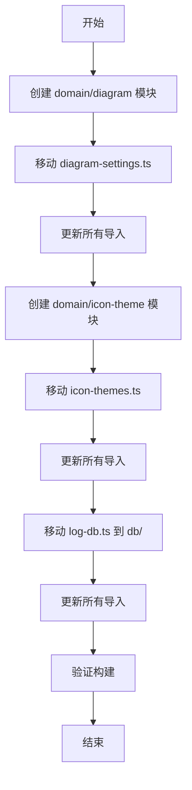

# Design Document: Lib Directory Cleanup

## Overview

本文档描述了对 `apps/desktop/src/lib/` 目录的清理和重组设计。目标是将文件移动到符合项目架构规范的正确位置。

### Goals

1. 将 Zustand store 移动到 domain 模块
2. 将数据库定义移动到 db 目录
3. 将包含副作用的配置移动到 domain 模块
4. 保留纯配置文件在 lib 目录
5. 确保所有文件符合命名规范

### Non-Goals

1. 修改文件的功能逻辑
2. 添加新功能
3. 修改现有 API

## Architecture

### Current State

```
lib/
├── diagram-presets.ts      # ✅ 纯配置数据
├── diagram-settings.ts     # ❌ Zustand store (应在 domain/)
├── font-config.ts          # ✅ 纯配置数据
├── fuzzy-match.utils.ts    # ✅ 纯工具函数
├── icon-themes.ts          # ❌ 包含 localStorage 副作用
├── icons.ts                # ✅ 纯配置数据
├── log-db.ts               # ❌ 数据库定义 (应在 db/)
├── themes.ts               # ✅ 纯配置数据
├── ui-config.ts            # ✅ 纯配置数据
└── utils.ts                # ✅ 纯工具函数
```

### Target State

```
lib/
├── diagram-presets.ts      # 纯配置数据
├── font-config.ts          # 纯配置数据
├── fuzzy-match.utils.ts    # 纯工具函数
├── icons.ts                # 纯配置数据
├── themes.ts               # 纯配置数据
├── ui-config.ts            # 纯配置数据
└── utils.ts                # 纯工具函数

domain/
├── diagram/
│   ├── diagram.interface.ts
│   ├── diagram.store.ts
│   └── index.ts
└── icon-theme/
    ├── icon-theme.interface.ts
    ├── icon-theme.config.ts    # 图标主题配置数据
    ├── icon-theme.store.ts     # localStorage 操作封装
    ├── icon-theme.utils.ts     # 纯工具函数
    └── index.ts

db/
└── log-db.ts               # 日志数据库定义
```

## Components and Interfaces

### 1. Diagram Domain Module

```typescript
// domain/diagram/diagram.interface.ts
export interface DiagramSettings {
  krokiServerUrl: string;
  enableKroki: boolean;
}

export interface DiagramActions {
  setKrokiServerUrl: (url: string) => void;
  setEnableKroki: (enabled: boolean) => void;
  testKrokiConnection: () => Promise<boolean>;
}

export type DiagramStore = DiagramSettings & DiagramActions;
```

### 2. Icon Theme Domain Module

```typescript
// domain/icon-theme/icon-theme.interface.ts
export interface IconTheme {
  key: string;
  name: string;
  description: string;
  author?: string;
  icons: IconThemeIcons;
}

export interface IconThemeState {
  currentThemeKey: string;
}

export interface IconThemeActions {
  setTheme: (key: string) => void;
}

export type IconThemeStore = IconThemeState & IconThemeActions;
```

### 3. Log Database

```typescript
// db/log-db.ts
// 保持现有结构，仅移动位置
export interface LogEntry {
  id?: number;
  timestamp: string;
  level: string;
  message: string;
}
```

## Data Models

无新数据模型，仅重组现有代码。

## Correctness Properties

*A property is a characteristic or behavior that should hold true across all valid executions of a system-essentially, a formal statement about what the system should do. Properties serve as the bridge between human-readable specifications and machine-verifiable correctness guarantees.*

本次重构主要是代码组织变更，不涉及运行时行为变化。所有验收标准都是结构性的，通过以下方式验证：

1. **构建验证**: 项目能够成功构建，无类型错误
2. **Lint 验证**: 无未使用的导入或导出
3. **运行时验证**: 应用功能正常工作

由于这是纯粹的代码重组，没有可测试的运行时属性。

## Error Handling

移动文件时需要确保：

1. 所有导入路径正确更新
2. 导出保持向后兼容（如需要可添加 re-export）
3. 构建和测试通过

## Testing Strategy

### 验证方法

1. **构建测试**: `bun run build` 确保无编译错误
2. **Lint 检查**: `bun run lint` 确保无代码质量问题
3. **手动测试**: 验证图表设置、图标主题、日志功能正常工作

### 无需 Property-Based Testing

本次重构不涉及业务逻辑变更，仅是文件位置调整，因此不需要 property-based testing。

## Migration Sequence



## Specific Tasks

### Task 1: 创建 diagram domain 模块

1. 创建 `domain/diagram/diagram.interface.ts`
2. 创建 `domain/diagram/diagram.store.ts` (从 lib/diagram-settings.ts 移动)
3. 创建 `domain/diagram/index.ts`
4. 删除 `lib/diagram-settings.ts`
5. 更新所有导入

### Task 2: 创建 icon-theme domain 模块

1. 创建 `domain/icon-theme/icon-theme.interface.ts`
2. 创建 `domain/icon-theme/icon-theme.config.ts` (图标主题数据)
3. 创建 `domain/icon-theme/icon-theme.store.ts` (localStorage 操作)
4. 创建 `domain/icon-theme/icon-theme.utils.ts` (纯工具函数)
5. 创建 `domain/icon-theme/index.ts`
6. 删除 `lib/icon-themes.ts`
7. 更新所有导入

### Task 3: 移动 log-db.ts

1. 移动 `lib/log-db.ts` 到 `db/log-db.ts`
2. 更新所有导入

