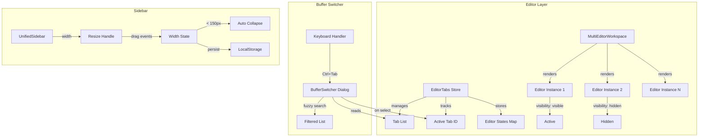

# Design Document

## Overview

本设计文档描述了三个核心功能的技术实现方案：

1. **多编辑器实例架构** - 将单编辑器切换模式改为多实例模式，每个标签页维护独立的 Lexical 编辑器实例
2. **Buffer Switcher 组件** - 实现 Emacs 风格的文件切换弹窗，支持快捷键触发和模糊搜索
3. **可拖动侧边栏** - 为统一侧边栏添加拖动调整宽度功能，支持自动折叠

## Architecture



## Components and Interfaces

### 1. Multi-Editor Instance System

#### EditorTabsStore 扩展

```typescript
interface EditorInstanceState {
  // Lexical 序列化状态
  serializedState: SerializedEditorState;
  // 光标位置（通过 selection state 恢复）
  selectionState?: SerializedSelection;
  // 滚动位置
  scrollTop: number;
  scrollLeft: number;
  // 是否有未保存更改
  isDirty: boolean;
}

interface EditorTabsState {
  tabs: EditorTab[];
  activeTabId: string | null;
  // 新增：每个标签的编辑器状态
  editorStates: Record<string, EditorInstanceState>;
  
  // 新增 Actions
  updateEditorState: (tabId: string, state: Partial<EditorInstanceState>) => void;
  getEditorState: (tabId: string) => EditorInstanceState | undefined;
}
```

#### MultiEditorWorkspace 组件

```typescript
interface MultiEditorWorkspaceProps {
  tabs: EditorTab[];
  activeTabId: string | null;
  editorStates: Record<string, EditorInstanceState>;
  onEditorChange: (tabId: string, state: SerializedEditorState) => void;
  onScrollChange: (tabId: string, scrollTop: number, scrollLeft: number) => void;
}

// 渲染所有编辑器实例，通过 CSS 控制可见性
function MultiEditorWorkspace({ tabs, activeTabId, editorStates, onEditorChange, onScrollChange }: MultiEditorWorkspaceProps) {
  return (
    <div className="relative h-full">
      {tabs.map(tab => (
        <div
          key={tab.id}
          className={cn(
            "absolute inset-0",
            tab.id === activeTabId ? "visible z-10" : "invisible z-0"
          )}
        >
          <MinimalEditor
            editorSerializedState={editorStates[tab.id]?.serializedState}
            onSerializedChange={(state) => onEditorChange(tab.id, state)}
            // 不使用 key 强制重建，保持实例
          />
        </div>
      ))}
    </div>
  );
}
```

### 2. Buffer Switcher Component

#### BufferSwitcher 组件

```typescript
interface BufferSwitcherProps {
  open: boolean;
  onOpenChange: (open: boolean) => void;
  tabs: EditorTab[];
  activeTabId: string | null;
  onSelectTab: (tabId: string) => void;
  initialDirection?: 'forward' | 'backward';
}

// 使用 cmdk 库实现命令面板风格的切换器
function BufferSwitcher({ open, onOpenChange, tabs, activeTabId, onSelectTab, initialDirection }: BufferSwitcherProps) {
  const [search, setSearch] = useState('');
  const [selectedIndex, setSelectedIndex] = useState(0);
  
  // 模糊搜索过滤
  const filteredTabs = useMemo(() => {
    if (!search) return tabs;
    return tabs.filter(tab => 
      fuzzyMatch(tab.title.toLowerCase(), search.toLowerCase())
    );
  }, [tabs, search]);
  
  // 键盘导航
  useEffect(() => {
    const handleKeyDown = (e: KeyboardEvent) => {
      if (e.key === 'ArrowDown') {
        setSelectedIndex(i => Math.min(i + 1, filteredTabs.length - 1));
      } else if (e.key === 'ArrowUp') {
        setSelectedIndex(i => Math.max(i - 1, 0));
      } else if (e.key === 'Enter') {
        const selected = filteredTabs[selectedIndex];
        if (selected) {
          onSelectTab(selected.id);
          onOpenChange(false);
        }
      } else if (e.key === 'Escape') {
        onOpenChange(false);
      }
    };
    // ...
  }, [filteredTabs, selectedIndex]);
  
  return (
    <Dialog open={open} onOpenChange={onOpenChange}>
      {/* 搜索输入 + 标签列表 */}
    </Dialog>
  );
}
```

#### 快捷键处理

```typescript
// 在 __root.tsx 或全局键盘处理器中
useEffect(() => {
  const handleKeyDown = (e: KeyboardEvent) => {
    // Ctrl+Tab 打开 buffer switcher
    if (e.ctrlKey && e.key === 'Tab') {
      e.preventDefault();
      setBufferSwitcherOpen(true);
      setBufferSwitcherDirection(e.shiftKey ? 'backward' : 'forward');
    }
  };
  
  window.addEventListener('keydown', handleKeyDown);
  return () => window.removeEventListener('keydown', handleKeyDown);
}, []);
```

### 3. Resizable Sidebar

#### ResizeHandle 组件

```typescript
interface ResizeHandleProps {
  onResize: (deltaX: number) => void;
  onResizeEnd: () => void;
  position: 'left' | 'right';
}

function ResizeHandle({ onResize, onResizeEnd, position }: ResizeHandleProps) {
  const [isDragging, setIsDragging] = useState(false);
  
  const handleMouseDown = (e: React.MouseEvent) => {
    e.preventDefault();
    setIsDragging(true);
    
    const startX = e.clientX;
    
    const handleMouseMove = (e: MouseEvent) => {
      const deltaX = e.clientX - startX;
      onResize(position === 'right' ? deltaX : -deltaX);
    };
    
    const handleMouseUp = () => {
      setIsDragging(false);
      onResizeEnd();
      document.removeEventListener('mousemove', handleMouseMove);
      document.removeEventListener('mouseup', handleMouseUp);
    };
    
    document.addEventListener('mousemove', handleMouseMove);
    document.addEventListener('mouseup', handleMouseUp);
  };
  
  return (
    <div
      className={cn(
        "absolute top-0 bottom-0 w-1 cursor-col-resize",
        "hover:bg-primary/20 transition-colors",
        isDragging && "bg-primary/30",
        position === 'right' ? 'right-0' : 'left-0'
      )}
      onMouseDown={handleMouseDown}
    />
  );
}
```

#### UnifiedSidebar 扩展

```typescript
// 在 unified-sidebar.ts store 中已有 width 和 setWidth
// 需要添加自动折叠逻辑

const AUTO_COLLAPSE_THRESHOLD = 150;
const MIN_WIDTH = 200;
const MAX_WIDTH = 600;

function UnifiedSidebar() {
  const { width, setWidth, isOpen, setIsOpen } = useUnifiedSidebarStore();
  const [dragStartWidth, setDragStartWidth] = useState(width);
  
  const handleResize = (deltaX: number) => {
    const newWidth = dragStartWidth + deltaX;
    
    // 自动折叠检测
    if (newWidth < AUTO_COLLAPSE_THRESHOLD) {
      setIsOpen(false);
      return;
    }
    
    // 约束范围
    const constrainedWidth = Math.max(MIN_WIDTH, Math.min(MAX_WIDTH, newWidth));
    setWidth(constrainedWidth);
  };
  
  const handleResizeEnd = () => {
    // 持久化到 localStorage（zustand persist 自动处理）
  };
  
  return (
    <div 
      className="relative shrink-0 bg-sidebar border-r"
      style={{ width: isOpen ? `${width}px` : 0 }}
    >
      {isOpen && (
        <>
          {/* 面板内容 */}
          <ResizeHandle 
            position="right"
            onResize={handleResize}
            onResizeEnd={handleResizeEnd}
          />
        </>
      )}
    </div>
  );
}
```

## Data Models

### EditorTab (扩展)

```typescript
interface EditorTab {
  id: string;
  projectId: string;
  chapterId: string;
  sceneId: string;
  title: string;
  type: "scene" | "diary" | "canvas";
  isDirty?: boolean;
}
```

### EditorInstanceState (新增)

```typescript
interface EditorInstanceState {
  serializedState: SerializedEditorState;
  selectionState?: {
    anchor: { key: string; offset: number };
    focus: { key: string; offset: number };
  };
  scrollTop: number;
  scrollLeft: number;
  isDirty: boolean;
  lastModified: number; // timestamp for LRU cleanup
}
```

### SidebarState (扩展)

```typescript
interface UnifiedSidebarState {
  activePanel: UnifiedSidebarPanel;
  isOpen: boolean;
  width: number;
  // 新增
  wasCollapsedByDrag: boolean; // 区分手动关闭和拖动折叠
  previousWidth: number; // 折叠前的宽度，用于恢复
}
```

## Correctness Properties

*A property is a characteristic or behavior that should hold true across all valid executions of a system-essentially, a formal statement about what the system should do. Properties serve as the bridge between human-readable specifications and machine-verifiable correctness guarantees.*

### Property 1: Editor Instance Isolation
*For any* set of open tabs, each tab's editor state (content, undo history) SHALL be independent, such that modifications to one tab's editor do not affect any other tab's editor state.
**Validates: Requirements 1.1, 1.3**

### Property 2: Editor State Preservation Round-Trip
*For any* editor instance with a given cursor position and scroll position, switching to another tab and back SHALL restore the exact same cursor position and scroll position.
**Validates: Requirements 1.2**

### Property 3: Tab Close Cleanup
*For any* tab that is closed, the corresponding editor state entry SHALL be removed from the editorStates map, and the tab SHALL be removed from the tabs array.
**Validates: Requirements 1.5**

### Property 4: Fuzzy Search Filtering
*For any* search query and list of tabs, the filtered result SHALL contain only tabs whose titles match the fuzzy search criteria, and the order SHALL prioritize exact matches over partial matches.
**Validates: Requirements 2.3**

### Property 5: Buffer Switcher Tab Display
*For any* tab displayed in the buffer switcher, the rendered item SHALL contain the file title, parent chapter name (if available), and appropriate file type icon.
**Validates: Requirements 2.7**

### Property 6: Sidebar Width Constraints
*For any* drag operation on the sidebar resize handle, the resulting sidebar width SHALL be constrained between MIN_WIDTH (200px) and MAX_WIDTH (600px), unless the width drops below AUTO_COLLAPSE_THRESHOLD (150px) which triggers collapse.
**Validates: Requirements 3.3, 3.4**

### Property 7: Sidebar Width Persistence Round-Trip
*For any* sidebar width set by the user, after persisting to localStorage and reloading the store, the restored width SHALL equal the previously set width.
**Validates: Requirements 3.6, 3.7**

## Error Handling

### Multi-Editor System
- **Memory Pressure**: 当打开的标签数量超过阈值（如 20 个）时，使用 LRU 策略卸载最久未访问的编辑器实例，保留其序列化状态
- **State Corruption**: 如果编辑器状态解析失败，回退到空白编辑器状态并显示警告
- **Save Conflicts**: 当多个编辑器实例尝试保存同一文件时，使用最后写入优先策略

### Buffer Switcher
- **Empty Tab List**: 当没有打开的标签时，显示提示信息而非空列表
- **Search No Results**: 当搜索无匹配时，显示"无匹配结果"提示

### Resizable Sidebar
- **Invalid Width**: 如果从 localStorage 读取的宽度无效，使用默认值 320px
- **Drag Outside Window**: 当拖动超出窗口边界时，停止调整并保持当前宽度

## Testing Strategy

### Property-Based Testing Library
使用 **fast-check** 作为 TypeScript 的属性测试库。

### Unit Tests
- 测试 EditorTabsStore 的基本 CRUD 操作
- 测试 fuzzyMatch 函数的边界情况
- 测试 ResizeHandle 的约束逻辑

### Property-Based Tests
每个属性测试配置运行 100 次迭代。

1. **Property 1 测试**: 生成随机的标签列表和编辑操作序列，验证编辑器隔离性
2. **Property 2 测试**: 生成随机的光标位置和滚动位置，验证切换后状态恢复
3. **Property 3 测试**: 生成随机的标签关闭序列，验证状态清理
4. **Property 4 测试**: 生成随机的搜索查询和标签标题，验证模糊搜索结果
5. **Property 5 测试**: 生成随机的标签数据，验证渲染输出包含所有必要信息
6. **Property 6 测试**: 生成随机的拖动位置，验证宽度约束
7. **Property 7 测试**: 生成随机的宽度值，验证持久化往返

### Test Annotations
每个属性测试必须使用以下格式标注：
```typescript
// **Feature: multi-editor-emacs-sidebar, Property 1: Editor Instance Isolation**
```

