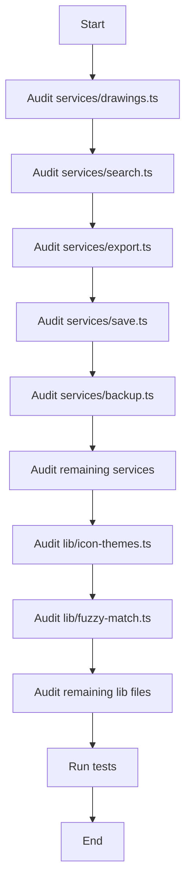

# Design Document: Services and Lib Refactor

## Overview

This document outlines the technical design for auditing and refactoring the `services/` and `lib/` directories in the Grain desktop application. The goal is to ensure all code follows the established architecture patterns: Repository pattern for data access, pure functions in `.utils.ts` files, and proper domain module organization.

### Goals

1. Audit all service files for architecture compliance
2. Audit all lib files for proper organization
3. Extract pure functions to `.utils.ts` files
4. Ensure services use Repository pattern for database access
5. Move domain-specific code to appropriate domain modules
6. Remove unused imports and dead code

### Non-Goals

1. Backward compatibility (direct migration without re-exports)
2. Changes to the Repository pattern implementation
3. Changes to the domain module structure

## Architecture

### Current State Analysis

#### Services Directory (`apps/desktop/src/services/`)

| File | Lines | Issues |
|------|-------|--------|
| `backup.ts` | ~200 | Uses Repository pattern ✓, has pure functions that could be extracted |
| `clear-data.ts` | ~50 | Needs audit |
| `db-init.ts` | ~50 | Needs audit |
| `diary-v2.ts` | ~100 | Needs audit |
| `drawings.ts` | ~150 | Direct database access via `database.drawings`, should use DrawingRepository |
| `export-path.ts` | ~50 | Needs audit |
| `export.ts` | ~400 | Large file, has pure functions (extractTextFromContent, escapeHtml) |
| `file-creator.ts` | ~50 | Needs audit |
| `import-export.ts` | ~100 | Needs audit |
| `keyboard-shortcuts.ts` | ~100 | Needs audit |
| `nodes.ts` | ~200 | Uses Repository pattern ✓, re-exports hooks properly |
| `overflow-detection.ts` | ~50 | Needs audit |
| `save.ts` | ~150 | Uses Repository pattern ✓, has pure function (extractTagsFromContent) |
| `search.ts` | ~200 | Direct database access, has pure functions |
| `tags.ts` | ~50 | Properly delegates to TagRepository ✓ |
| `updater.ts` | ~50 | Needs audit |
| `wiki-files.ts` | ~100 | Needs audit |
| `wiki-migration.ts` | ~100 | Needs audit |
| `workspaces.ts` | ~50 | Uses Repository pattern ✓, has React hook |

#### Lib Directory (`apps/desktop/src/lib/`)

| File | Purpose | Issues |
|------|---------|--------|
| `diagram-presets.ts` | Config | Pure functions, should be `diagram-presets.utils.ts` or keep as config |
| `diagram-settings.ts` | Config | Needs audit |
| `font-config.ts` | Config | Needs audit |
| `fuzzy-match.ts` | Utils | Should be `fuzzy-match.utils.ts` |
| `icon-themes.ts` | Config | Has unused import (Workflow), has side effects (localStorage) |
| `icons.ts` | Config | Needs audit |
| `log-db.ts` | Utils | Needs audit |
| `next-dynamic.tsx` | React | Should be in components or hooks |
| `themes.ts` | Config | Large file (~2400 lines), pure config data |
| `ui-config.ts` | Config | Pure config ✓ |
| `utils.ts` | Utils | Only has `cn()` function ✓ |

### Target State

```
services/
├── backup.ts              # Uses Repository, extracted utils
├── backup.utils.ts        # Pure functions from backup
├── clear-data.ts
├── db-init.ts
├── diary-v2.ts
├── drawings.ts            # Refactored to use DrawingRepository
├── export.ts              # Refactored, extracted utils
├── export.utils.ts        # Pure functions from export
├── file-creator.ts
├── import-export.ts
├── keyboard-shortcuts.ts
├── nodes.ts               # Already compliant ✓
├── overflow-detection.ts
├── save.ts                # Extracted utils
├── save.utils.ts          # Pure functions from save
├── search.ts              # Refactored to use Repository
├── search.utils.ts        # Pure functions from search
├── tags.ts                # Already compliant ✓
├── updater.ts
├── wiki-files.ts
├── wiki-migration.ts
└── workspaces.ts          # Already compliant ✓

lib/
├── diagram-presets.ts     # Config data
├── diagram-settings.ts    # Config data
├── font-config.ts         # Config data
├── fuzzy-match.utils.ts   # Renamed from fuzzy-match.ts
├── icon-themes.ts         # Config, removed unused imports
├── icons.ts               # Config data
├── log-db.ts
├── themes.ts              # Config data
├── ui-config.ts           # Config data ✓
└── utils.ts               # General utils ✓
```

## Components and Interfaces

### Service Refactoring Pattern

Each service should follow this pattern:

```typescript
/**
 * {Service Name} Service
 * {Description of what the service does}
 *
 * Requirements: {requirement references}
 */

import { SomeRepository, type SomeInterface } from "@/db/models";
import { pureFunction } from "./service-name.utils";

// Service functions that orchestrate Repository calls
export async function doSomething(params: Params): Promise<Result> {
  // Use Repository for data access
  const data = await SomeRepository.getById(params.id);
  
  // Use pure functions for transformations
  const transformed = pureFunction(data);
  
  return transformed;
}
```

### Utils File Pattern

Each utils file should follow this pattern:

```typescript
/**
 * {Feature} Utilities
 * Pure functions for {description}
 *
 * Requirements: {requirement references}
 */

/**
 * {Function description}
 * @param input - {description}
 * @returns {description}
 */
export function pureFunction(input: Input): Output {
  // No side effects
  // No external state access
  // Deterministic output
  return result;
}
```

## Data Models

No new data models are introduced. This refactoring focuses on code organization.

## Correctness Properties

*A property is a characteristic or behavior that should hold true across all valid executions of a system-essentially, a formal statement about what the system should do. Properties serve as the bridge between human-readable specifications and machine-verifiable correctness guarantees.*

### Property 1: Pure Functions Produce Consistent Output
*For any* pure function in a `.utils.ts` file and any valid input, calling the function multiple times with the same input SHALL produce identical output.
**Validates: Requirements 3.1, 3.2**

### Property 2: Pure Functions Do Not Mutate Input
*For any* pure function that takes an object as input, the input object SHALL remain unchanged after the function call.
**Validates: Requirements 3.3**

### Property 3: Text Extraction Round Trip Consistency
*For any* Lexical editor state, extracting text and then searching for that text in the original content SHALL find matches.
**Validates: Requirements 3.1, 3.2**

## Error Handling

### Service Error Handling Pattern

Services should handle errors consistently:

```typescript
export async function serviceFunction(params: Params): Promise<Result> {
  try {
    // Service logic
    return result;
  } catch (error) {
    logger.error("Service operation failed:", error);
    throw error; // Re-throw for caller to handle
  }
}
```

### Utils Error Handling

Pure functions should not throw errors for invalid input; instead, they should return safe defaults or use type guards:

```typescript
export function safeExtract(content: string | null): string {
  if (!content) return "";
  try {
    // Processing
    return result;
  } catch {
    return "";
  }
}
```

## Testing Strategy

### Dual Testing Approach

This refactoring uses both unit tests and property-based tests:

1. **Unit Tests**: Verify specific examples and edge cases for each extracted pure function
2. **Property-Based Tests**: Verify universal properties across all inputs

### Property-Based Testing Library

- **Library**: fast-check (TypeScript/JavaScript)
- **Minimum Iterations**: 100 per property test
- **Test File Location**: `apps/desktop/src/services/__tests__/{name}.property.test.ts`

### Test Annotation Format

Each property-based test SHALL be annotated with:
```typescript
/**
 * **Feature: services-lib-refactor, Property {number}: {property_text}**
 * **Validates: Requirements {X.Y}**
 */
```

### Unit Test Coverage

Unit tests SHALL cover:
- Each extracted pure function with representative inputs
- Edge cases (null, undefined, empty strings, empty arrays)
- Error conditions and boundary values

### Property Test Coverage

Property tests SHALL verify:
- Function purity (Property 1)
- Input immutability (Property 2)
- Text extraction consistency (Property 3)

## Audit Checklist

### Service Audit Steps

For each service file:

1. [ ] Check for direct `database.{table}` access → Replace with Repository
2. [ ] Identify pure functions → Extract to `{service}.utils.ts`
3. [ ] Check for React hooks → Move to appropriate location
4. [ ] Verify JSDoc documentation exists
5. [ ] Check file size (>300 lines needs splitting consideration)
6. [ ] Verify error handling patterns
7. [ ] Check import patterns use `@/db/models`

### Lib Audit Steps

For each lib file:

1. [ ] Determine if domain-specific → Move to `src/domain/`
2. [ ] Check for side effects in functions
3. [ ] Verify naming convention matches purpose
4. [ ] Check for unused imports → Remove
5. [ ] Check for React hooks → Move to `src/hooks/`
6. [ ] Verify TypeScript types are properly exported

## Migration Sequence



## Specific Refactoring Tasks

### 1. services/drawings.ts

**Current Issues:**
- Uses `database.drawings` directly instead of `DrawingRepository`
- Has `useLiveQuery` hook that should use existing hooks

**Actions:**
- Replace `database.drawings.get()` with `DrawingRepository.getById()`
- Replace `database.drawings.where()` with `DrawingRepository.getByWorkspace()`
- Use existing hooks from `@/db/models` or create new ones

### 2. services/search.ts

**Current Issues:**
- Direct database access via `database.nodes.toArray()`
- Has pure functions: `extractTextFromContent`, `extractTextFromLexical`, `generateExcerpt`, `extractHighlights`, `calculateSimpleScore`

**Actions:**
- Extract pure functions to `search.utils.ts`
- Use `NodeRepository` for node access
- Use `ContentRepository` for content access (already partially done)

### 3. services/export.ts

**Current Issues:**
- Large file (~400 lines)
- Has pure functions: `extractTextFromContent`, `extractTextFromNode`, `escapeHtml`, `generatePrintHtml`, `generateEpubChapterHtml`

**Actions:**
- Extract pure functions to `export.utils.ts`
- Keep export orchestration in main file

### 4. lib/icon-themes.ts

**Current Issues:**
- Unused import: `Workflow`
- Has side effects: `localStorage.getItem/setItem`

**Actions:**
- Remove unused `Workflow` import
- Consider moving localStorage functions to a separate file or keeping as-is (config with side effects is acceptable for theme persistence)

### 5. lib/fuzzy-match.ts

**Current Issues:**
- Should be named `fuzzy-match.utils.ts` per naming convention

**Actions:**
- Rename to `fuzzy-match.utils.ts`
- Update all imports
