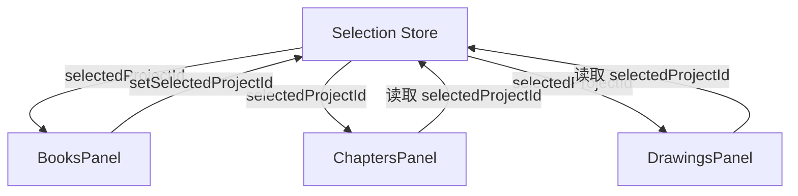

# Design Document: UI Cleanup and Improvements

## Overview

本设计文档描述了桌面应用 UI 清理和改进的实现方案，包括删除右侧边栏、调整 Activity Bar 图标、删除重复日志页面、简化章节管理面板、以及添加 Git Tag 构建脚本。

## Architecture

### 组件层次结构

```
RootComponent
├── ActivityBar (左侧导航栏)
│   ├── 书籍管理按钮 (1st)
│   ├── 章节管理按钮 (2nd)
│   ├── Wiki按钮 (3rd)
│   ├── 搜索按钮 (4th)
│   └── 大纲按钮 (5th)
├── UnifiedSidebar (统一侧边栏)
│   ├── BooksPanel
│   ├── ChaptersPanel (简化版，无书籍选择)
│   ├── WikiPanel
│   ├── SearchPanel
│   └── DrawingsPanel
└── MainContent (主内容区)
    └── Outlet (路由内容)
```

### 数据流



## Components and Interfaces

### 1. ActivityBar 组件修改

**文件**: `apps/desktop/src/components/activity-bar.tsx`

**修改内容**:
- 调整图标顺序：书籍管理 → 章节管理 → Wiki → 搜索 → 大纲
- 为每个功能使用不同的图标
- 移除绘图(Canvas)按钮从主导航区

**图标映射**:
| 功能 | 图标 | 说明 |
|------|------|------|
| 书籍管理 | Library/BookMarked | 书库图标 |
| 章节管理 | FolderTree | 文件夹树图标 |
| Wiki | BookOpen | 打开的书本图标 |
| 搜索 | Search | 搜索图标 |
| 大纲 | ListTree | 列表树图标 |

### 2. ChaptersPanel 组件修改

**文件**: `apps/desktop/src/components/panels/chapters-panel.tsx`

**修改内容**:
- 移除书籍选择下拉框 (Select 组件)
- 直接使用全局 `selectedProjectId` 从 `useSelectionStore`
- 移除 `handleProjectChange` 函数
- 移除章节菜单中的 "Add Canvas" 选项

### 3. RootComponent 修改

**文件**: `apps/desktop/src/routes/__root.tsx`

**修改内容**:
- 移除 `rightSidebarOpen` 状态
- 移除 `SidebarProvider` 的 `open` 和 `onOpenChange` props
- 移除 localStorage 中右侧边栏状态的读写

### 4. 删除文件

- `apps/desktop/src/routes/log.tsx` - 重复的日志页面
- `apps/desktop/src/components/story-right-sidebar.tsx` - 右侧边栏组件（可选，如果没有其他地方使用）

### 5. Icon Theme 系统更新

**文件**: `apps/desktop/src/lib/icon-themes.ts`

**修改内容**:
- 确保每个主题的 `activityBar` 配置包含所有必需的图标
- 确保图标在不同主题间保持一致的语义

## Data Models

### DrawingInterface (现有，无需修改)

```typescript
interface DrawingInterface {
  id: string;           // 绘图唯一标识
  project: string;      // 所属项目 ID (书籍级别)
  name: string;         // 绘图名称
  content: string;      // Excalidraw 数据
  width: number;
  height: number;
  createDate: string;
  updatedAt: string;
}
```

绘图已经正确关联到项目级别，不需要修改数据模型。

### Git Tag 脚本

**文件**: `scripts/create-tag.sh`

```bash
#!/bin/bash
# 创建并推送 Git Tag 以触发 CI/CD 构建

TAG_TYPE=$1  # desktop, snap, aur, all
VERSION=$(node -p "require('./package.json').version")

create_and_push_tag() {
    local prefix=$1
    local tag="${prefix}-v${VERSION}"
    echo "Creating tag: $tag"
    git tag -a "$tag" -m "Release $tag"
    git push origin "$tag"
}

case $TAG_TYPE in
    desktop) create_and_push_tag "desktop" ;;
    snap) create_and_push_tag "snap" ;;
    aur) create_and_push_tag "aur" ;;
    all)
        create_and_push_tag "desktop"
        create_and_push_tag "snap"
        create_and_push_tag "aur"
        ;;
    *) echo "Usage: $0 {desktop|snap|aur|all}" ;;
esac
```

## Correctness Properties

*A property is a characteristic or behavior that should hold true across all valid executions of a system-essentially, a formal statement about what the system should do. Properties serve as the bridge between human-readable specifications and machine-verifiable correctness guarantees.*

### Property 1: Icon Theme Change Propagation

*For any* icon theme change, all Activity Bar icons should update to reflect the new theme's icon set.

**Validates: Requirements 2.3**

### Property 2: Chapters Panel Project Synchronization

*For any* book selection in the Books Panel, the Chapters Panel should automatically display chapters belonging to that selected book.

**Validates: Requirements 4.2**

### Property 3: Drawing Project Association

*For any* drawing in the database, it should have a valid project ID and should not have a chapter ID association.

**Validates: Requirements 5.3**

### Property 4: Tag Version Consistency

*For any* tag creation operation, the version number in the tag should match the version in package.json.

**Validates: Requirements 6.5**

## Error Handling

### 无书籍选择时的处理

当用户打开章节管理面板但没有选择任何书籍时：
- 显示友好的提示信息："请先选择一本书籍"
- 提供快捷方式跳转到书库面板

### 图标主题加载失败

当图标主题加载失败时：
- 回退到默认图标主题
- 在控制台记录警告信息

### Git Tag 创建失败

当 Git Tag 创建失败时：
- 显示错误信息
- 提示可能的原因（如 tag 已存在、网络问题等）

## Testing Strategy

### 单元测试

使用 Vitest 进行单元测试：

1. **ActivityBar 图标顺序测试**: 验证图标按正确顺序渲染
2. **ChaptersPanel 无选择器测试**: 验证不渲染书籍选择下拉框
3. **Tag 脚本测试**: 验证脚本生成正确格式的 tag

### 属性测试

使用 fast-check 进行属性测试：

1. **图标主题变更测试**: 生成随机主题变更，验证所有图标更新
2. **项目同步测试**: 生成随机项目选择，验证章节面板同步
3. **版本一致性测试**: 验证 tag 版本与配置文件版本一致

### 测试框架配置

```typescript
// vitest.config.ts
export default {
  test: {
    globals: true,
    environment: 'jsdom',
    setupFiles: ['./src/test/setup.ts'],
  },
};
```

属性测试配置：
- 每个属性测试运行至少 100 次迭代
- 使用 fast-check 库进行属性测试
- 每个测试标注对应的 correctness property
