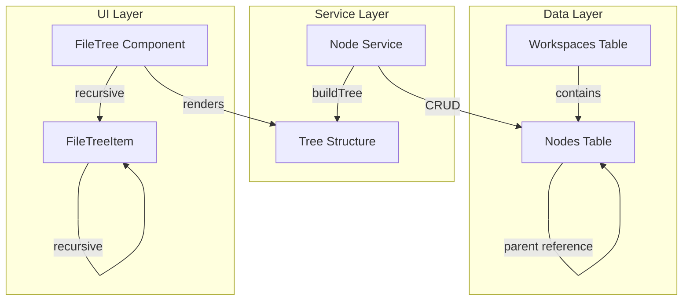

# Design Document

## Overview

本设计文档描述了将编辑器从固定的 `Project → Chapter → Scene` 结构重构为灵活的 `Workspace → Node` 结构的技术方案。

核心改动：
1. **数据库层**：新增 `nodes` 表，使用 `parent` 字段实现无限层级
2. **UI 层**：创建递归的 `FileTree` 组件替代现有的 `ChaptersPanel`
3. **兼容性**：保留 `projects` 表作为 `workspaces`，概念上重命名

## Architecture



## Components and Interfaces

### 1. Database Schema

#### NodeInterface (新增)

```typescript
export type NodeType = 'folder' | 'file' | 'canvas';

export interface NodeInterface {
  id: string;                    // UUID
  workspace: string;             // 所属工作空间 ID
  parent: string | null;         // 父节点 ID，null 表示根节点
  type: NodeType;                // 节点类型
  title: string;                 // 节点标题
  order: number;                 // 同级排序
  content?: string;              // 文件内容 (Lexical JSON 或 Excalidraw JSON)
  collapsed?: boolean;           // 文件夹是否折叠
  createDate: string;            // 创建时间
  lastEdit: string;              // 最后编辑时间
}
```

#### Dexie Schema Update

```typescript
// v5: Add nodes table for flexible file tree
this.version(5).stores({
  // ... existing tables
  nodes: "id, workspace, parent, type, order",
});
```

### 2. Node Service

```typescript
// apps/desktop/src/services/nodes.ts

interface TreeNode {
  id: string;
  title: string;
  type: NodeType;
  collapsed: boolean;
  children: TreeNode[];
  depth: number;
}

// 从扁平数据构建树结构
function buildTree(nodes: NodeInterface[], parentId: string | null = null, depth = 0): TreeNode[] {
  return nodes
    .filter(n => n.parent === parentId)
    .sort((a, b) => a.order - b.order)
    .map(node => ({
      id: node.id,
      title: node.title,
      type: node.type,
      collapsed: node.collapsed ?? true,
      depth,
      children: node.type === 'folder' ? buildTree(nodes, node.id, depth + 1) : [],
    }));
}

// 获取节点路径（面包屑）
function getNodePath(nodes: NodeInterface[], nodeId: string): NodeInterface[] {
  const path: NodeInterface[] = [];
  let current = nodes.find(n => n.id === nodeId);
  while (current) {
    path.unshift(current);
    current = current.parent ? nodes.find(n => n.id === current!.parent) : undefined;
  }
  return path;
}

// 重新排序节点
function reorderNodes(nodes: NodeInterface[], nodeId: string, newIndex: number): NodeInterface[] {
  // ... implementation
}
```

### 3. FileTree Component

```typescript
// apps/desktop/src/components/file-tree/file-tree.tsx

interface FileTreeProps {
  workspaceId: string;
  selectedNodeId: string | null;
  onSelectNode: (nodeId: string) => void;
  onCreateFolder: (parentId: string | null) => void;
  onCreateFile: (parentId: string | null, type: NodeType) => void;
  onDeleteNode: (nodeId: string) => void;
  onRenameNode: (nodeId: string, newTitle: string) => void;
  onMoveNode: (nodeId: string, newParentId: string | null, newIndex: number) => void;
}

function FileTree({ workspaceId, selectedNodeId, ...handlers }: FileTreeProps) {
  const nodes = useNodesByWorkspace(workspaceId);
  const tree = useMemo(() => buildTree(nodes), [nodes]);
  
  return (
    <div className="file-tree">
      {tree.map(node => (
        <FileTreeItem
          key={node.id}
          node={node}
          selectedId={selectedNodeId}
          {...handlers}
        />
      ))}
    </div>
  );
}
```

### 4. FileTreeItem Component (递归)

```typescript
// apps/desktop/src/components/file-tree/file-tree-item.tsx

interface FileTreeItemProps {
  node: TreeNode;
  selectedId: string | null;
  onSelect: (id: string) => void;
  onToggle: (id: string) => void;
  // ... other handlers
}

function FileTreeItem({ node, selectedId, onSelect, onToggle }: FileTreeItemProps) {
  const isSelected = node.id === selectedId;
  const hasChildren = node.children.length > 0;
  
  return (
    <div style={{ paddingLeft: `${node.depth * 16}px` }}>
      <div 
        className={cn("file-tree-item", isSelected && "selected")}
        onClick={() => node.type === 'folder' ? onToggle(node.id) : onSelect(node.id)}
      >
        {node.type === 'folder' && (
          <ChevronIcon expanded={!node.collapsed} />
        )}
        <NodeIcon type={node.type} />
        <span>{node.title}</span>
      </div>
      
      {node.type === 'folder' && !node.collapsed && (
        <div className="file-tree-children">
          {node.children.map(child => (
            <FileTreeItem key={child.id} node={child} {...props} />
          ))}
        </div>
      )}
    </div>
  );
}
```

## Data Models

### Node Types

| Type | Description | Content Format |
|------|-------------|----------------|
| `folder` | 文件夹，可包含子节点 | null |
| `file` | 文本文件 | Lexical JSON |
| `canvas` | 画布文件 | Excalidraw JSON |

### Tree Structure Example

```
Workspace: "我的小说"
├── 📁 第一卷 (parent: null, order: 0)
│   ├── 📄 序章 (parent: "第一卷", order: 0)
│   ├── 📄 第一章 (parent: "第一卷", order: 1)
│   └── 📁 附录 (parent: "第一卷", order: 2)
│       └── 📄 人物设定 (parent: "附录", order: 0)
├── 📁 第二卷 (parent: null, order: 1)
│   └── 📄 第一章 (parent: "第二卷", order: 0)
└── 📄 大纲笔记 (parent: null, order: 2)
```

## Correctness Properties

*A property is a characteristic or behavior that should hold true across all valid executions of a system-essentially, a formal statement about what the system should do. Properties serve as the bridge between human-readable specifications and machine-verifiable correctness guarantees.*

### Property 1: Tree Structure Integrity
*For any* set of nodes with parent references, the buildTree function SHALL produce a tree where every node appears exactly once and at the correct depth based on its parent chain.
**Validates: Requirements 2.1**

### Property 2: Node Creation with Parent
*For any* newly created node (folder or file), the node SHALL have the specified parent reference and be assigned the next available order number among its siblings.
**Validates: Requirements 1.1, 1.2**

### Property 3: Node Move Preserves Tree Integrity
*For any* node move operation, the resulting tree SHALL maintain valid parent references with no cycles and correct sibling ordering.
**Validates: Requirements 1.4**

### Property 4: Workspace Node Isolation
*For any* workspace, querying nodes by workspace ID SHALL return only nodes belonging to that workspace and no nodes from other workspaces.
**Validates: Requirements 3.3**

### Property 5: Node Rename Idempotence
*For any* node, renaming it to a new title and then querying it SHALL return the node with the updated title.
**Validates: Requirements 1.5**

## Error Handling

### Database Operations
- **Node Not Found**: 当操作的节点不存在时，返回 null 或抛出明确错误
- **Circular Reference**: 移动节点时检测循环引用，阻止将节点移动到其子节点下
- **Orphan Nodes**: 删除文件夹时，递归删除所有子节点

### UI Operations
- **Empty Tree**: 当工作空间没有节点时，显示"创建第一个文件"提示
- **Deep Nesting**: 限制最大嵌套深度为 10 层，防止性能问题

## Testing Strategy

### Property-Based Testing Library
使用 **fast-check** 作为 TypeScript 的属性测试库。

### Unit Tests
- 测试 `buildTree` 函数的边界情况（空数组、单节点、深度嵌套）
- 测试节点 CRUD 操作
- 测试节点移动和重排序逻辑

### Property-Based Tests
每个属性测试配置运行 100 次迭代。

1. **Property 1 测试**: 生成随机的节点列表和父子关系，验证 buildTree 输出的正确性
2. **Property 2 测试**: 生成随机的父节点 ID，创建节点，验证父引用和排序
3. **Property 3 测试**: 生成随机树结构，执行移动操作，验证树完整性
4. **Property 4 测试**: 生成多个工作空间的节点，验证查询隔离性
5. **Property 5 测试**: 生成随机节点和标题，验证重命名操作

### Test Annotations
每个属性测试必须使用以下格式标注：
```typescript
// **Feature: workspace-file-tree-refactor, Property 1: Tree Structure Integrity**
```
