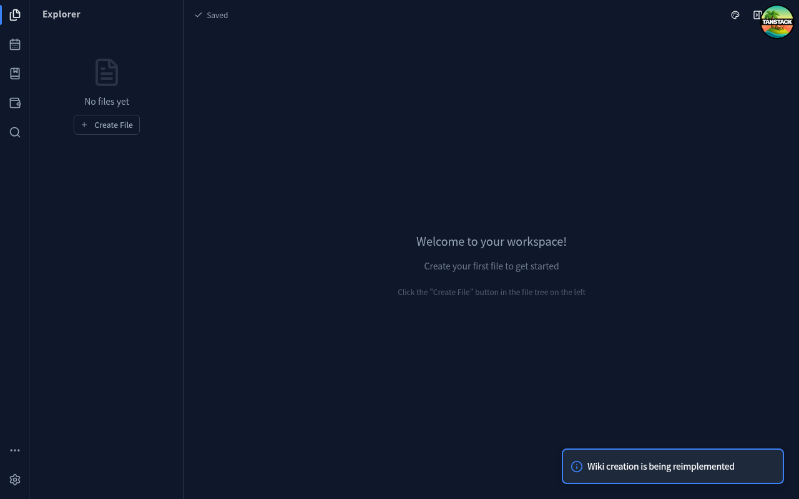

# E2E 测试发现的问题

本文档记录 E2E 测试过程中发现的问题。每个问题都包含详细的复现步骤、期望行为和实际行为。

## 问题记录格式

每个问题应包含以下信息：

- **Issue ID**: 唯一标识符（格式：E2E-YYYY-MM-DD-NNN）
- **严重程度**: critical（阻塞）| major（重要）| minor（次要）
- **测试套件**: 发现问题的测试套件名称
- **测试用例**: 发现问题的测试用例名称
- **描述**: 问题的简要描述
- **复现步骤**: 详细的复现步骤
- **期望行为**: 预期的正确行为
- **实际行为**: 实际观察到的行为
- **控制台错误**: 相关的控制台错误信息（如有）
- **截图**: 相关截图路径
- **相关需求**: 关联的需求编号

---

## 问题列表

## Issue E2E-2025-12-27-001: Diary 文件夹结构未在 File Tree 中显示

**发现时间**: 2025-12-27 13:08:15

**严重程度**: major

**测试套件**: Diary

**测试用例**: Diary Folder Structure Created

### 描述

创建 Diary 后，期望的文件夹结构（Diary > year-2025-Snake > month-12-December > day-27-Saturday）未在 File Tree 中显示。

### 复现步骤

1. 启动应用
2. 点击 Activity Bar 中的 "New Diary" 按钮
3. 等待 Toast 消息显示 "Diary created"
4. 检查 File Tree 中的文件夹结构

### 期望行为

File Tree 中应显示 Diary 文件夹及其子文件夹结构：
- Diary
  - year-2025-Snake
    - month-12-December
      - day-27-Saturday

### 实际行为

File Tree 中未找到 Diary 文件夹。可能是：
1. 文件夹结构使用了不同的命名格式
2. File Tree 未自动刷新
3. data-testid 选择器不匹配

### 控制台错误

```
DexieError2: DexieError2
    at saveLog (http://localhost:1420/src/log/index.ts:38:1)
```

### 截图


### 相关需求

Requirements 3.2, 3.3

### 状态

- [x] 待修复
- [ ] 修复中
- [ ] 已修复
- [ ] 已验证

---

## Issue E2E-2025-12-27-002: Diary 文件未在 File Tree 中显示

**发现时间**: 2025-12-27 13:08:15

**严重程度**: major

**测试套件**: Diary

**测试用例**: Diary File Appears in File Tree

### 描述

创建 Diary 后，文件未在 File Tree 中显示。测试尝试查找标题包含 "27"（当天日期）的文件，但未找到。

### 复现步骤

1. 启动应用
2. 点击 Activity Bar 中的 "New Diary" 按钮
3. 等待 Toast 消息显示
4. 检查 File Tree 中是否有新创建的文件

### 期望行为

File Tree 中应显示新创建的 Diary 文件，文件名应包含当天日期。

### 实际行为

File Tree 中未找到包含 "27" 的文件。

### 控制台错误

```
DexieError2: DexieError2
    at saveLog (http://localhost:1420/src/log/index.ts:38:1)
```

### 截图


### 相关需求

Requirements 3.3

### 状态

- [x] 待修复
- [ ] 修复中
- [ ] 已修复
- [ ] 已验证

---

## Issue E2E-2025-12-27-003: Editor Tabs 容器未找到

**发现时间**: 2025-12-27 13:08:15

**严重程度**: major

**测试套件**: Diary, Wiki, Ledger, Excalidraw

**测试用例**: File Auto Opened

### 描述

多个测试套件中，验证文件自动打开的测试失败，原因是 Editor Tabs 容器未找到。这可能是 data-testid 属性未正确添加。

### 复现步骤

1. 启动应用
2. 创建任意类型的文件（Diary/Wiki/Ledger/Excalidraw）
3. 检查 Editor Tabs 区域

### 期望行为

Editor Tabs 容器应有 `data-testid="editor-tabs"` 属性，且新创建的文件应自动打开并显示在标签页中。

### 实际行为

无法找到 `[data-testid="editor-tabs"]` 选择器对应的元素。

### 控制台错误

无特定错误

### 截图

无

### 相关需求

Requirements 3.4, 4.5, 5.4, 6.4, 7.5, 7.6

### 状态

- [x] 待修复
- [ ] 修复中
- [ ] 已修复
- [ ] 已验证

---

## Issue E2E-2025-12-27-004: DexieError2 控制台错误

**发现时间**: 2025-12-27 13:08:05

**严重程度**: minor

**测试套件**: 所有测试套件

**测试用例**: 所有测试用例

### 描述

所有测试运行期间，控制台持续出现 DexieError2 错误。这些错误来自 `saveLog` 函数，可能是日志保存到 IndexedDB 时出现问题。

### 复现步骤

1. 启动应用
2. 执行任意操作
3. 查看控制台

### 期望行为

不应有 DexieError2 错误。

### 实际行为

每次操作都会产生多个 DexieError2 错误：
```
DexieError2: DexieError2
    at saveLog (http://localhost:1420/src/log/index.ts:38:1)
```

### 控制台错误

```
DexieError2: DexieError2
    at saveLog (http://localhost:1420/src/log/index.ts:38:1)
```

### 截图

无

### 相关需求

Requirements 8.2

### 状态

- [x] 待修复
- [ ] 修复中
- [ ] 已修复
- [ ] 已验证

---

## Issue E2E-2025-12-27-005: HTML 嵌套 button 错误

**发现时间**: 2025-12-27 13:09:44

**严重程度**: minor

**测试套件**: Ledger, Excalidraw

**测试用例**: 文件创建后

### 描述

在 Ledger 和 Excalidraw 创建后，控制台出现 HTML 嵌套 button 错误。这是一个 React hydration 问题，表明 UI 组件中存在 button 嵌套 button 的情况。

### 复现步骤

1. 启动应用
2. 创建 Ledger 或 Excalidraw 文件
3. 查看控制台

### 期望行为

不应有 HTML 嵌套错误。

### 实际行为

控制台显示：
```
In HTML, <button> cannot be a descendant of <button>.
This will cause a hydration error.
```

错误发生在 Tooltip 组件中，可能是 TooltipTrigger 包裹了一个 button，而内部又有另一个 button。

### 控制台错误

```
In HTML, <button> cannot be a descendant of <button>.
This will cause a hydration error.

<button> cannot contain a nested <button>.
See this log for the ancestor stack trace.
```

### 截图

无

### 相关需求

Requirements 8.2

### 状态

- [x] 待修复
- [ ] 修复中
- [ ] 已修复
- [ ] 已验证

---

## Issue E2E-2025-12-27-006: Wiki 创建流程与预期不符

**发现时间**: 2025-12-27 13:08:51

**严重程度**: minor

**测试套件**: Wiki

**测试用例**: Enter Wiki Title and Confirm, Cancel Wiki Creation

### 描述

Wiki 创建流程与测试预期不符。测试期望点击 "New Wiki" 按钮后会弹出对话框让用户输入标题，但实际上没有对话框出现。Wiki 可能使用了不同的创建流程（如直接创建或使用命令面板）。

### 复现步骤

1. 启动应用
2. 点击 Activity Bar 中的 "New Wiki" 按钮
3. 观察是否有对话框弹出

### 期望行为

应弹出对话框让用户输入 Wiki 标题。

### 实际行为

没有对话框弹出，Wiki 可能直接创建或使用其他方式。

### 控制台错误

无特定错误

### 截图



### 相关需求

Requirements 4.1, 4.2, 4.7

### 状态

- [x] 待修复
- [ ] 修复中
- [ ] 已修复
- [ ] 已验证

---

## 问题统计

| 严重程度 | 数量 | 已修复 | 待修复 |
|----------|------|--------|--------|
| Critical | 0 | 0 | 0 |
| Major | 3 | 0 | 3 |
| Minor | 3 | 0 | 3 |
| **总计** | **6** | **0** | **6** |

---

## 更新日志

| 日期 | 操作 | 描述 |
|------|------|------|
| 2025-12-27 | 创建 | 首次运行 E2E 测试，记录 6 个问题 |

